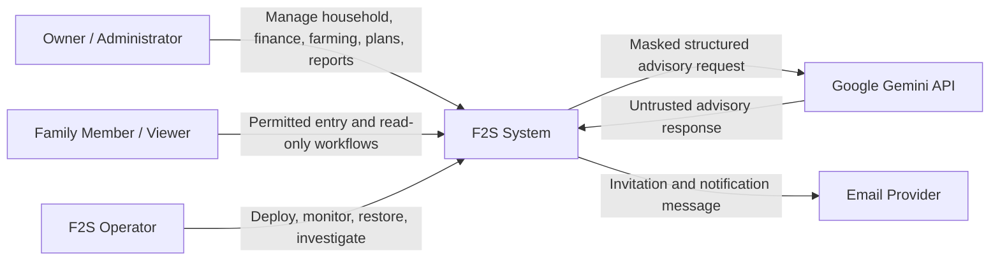
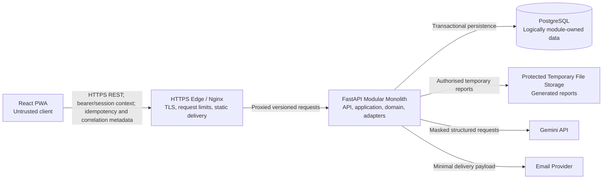
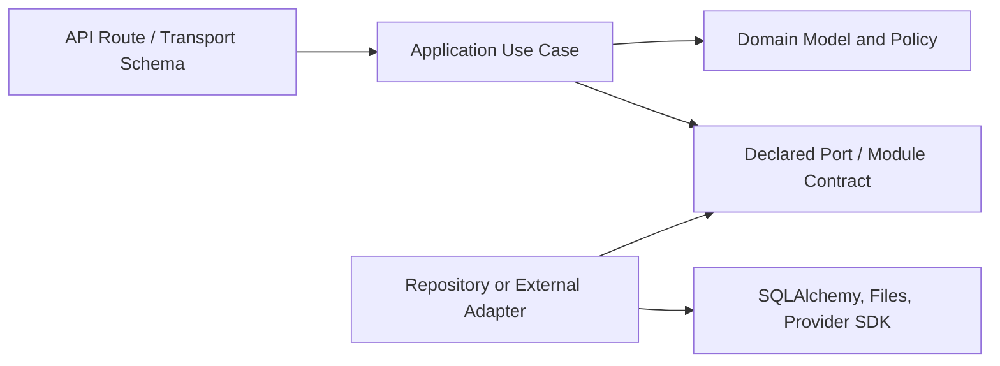
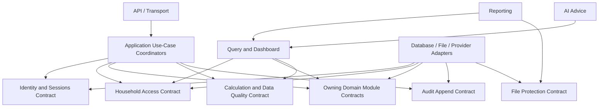
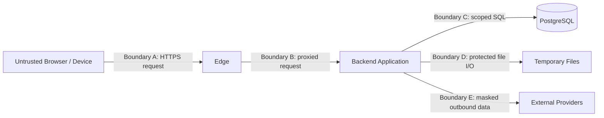

# F2S System Architecture

## 1. Purpose and status

This document expands [ADR-001: Use a Modular Monolith](adr/ADR-001-modular-monolith.md) into the conceptual system boundaries, module responsibilities, allowed dependencies, contracts, transaction rules, and trust boundaries for F2S.

It is the Phase 0 architecture baseline for later database, API, security, test, reporting, AI, and deployment designs. It does not approve a package structure, database schema, endpoint, queue, infrastructure resource, or application implementation.

## 2. Architecture drivers

The architecture must preserve these product properties:

1. Every protected operation and record is scoped to an authenticated actor and authorised household.
2. One backend calculation owner produces financial and farming results used by APIs, dashboards, reports, forecasts, and AI preparation.
3. A real financial event contributes once to cash flow and related balances, even when initiated by farming, sales, remittance, debt, or receivable workflows.
4. Core multi-record operations are atomic; external-service failure cannot corrupt an independently committed core record.
5. Empty, missing, incomplete, unreliable, estimated, and verified states remain distinguishable.
6. Reports and AI consume authorised verified datasets rather than querying module internals or recalculating values.
7. The initial system remains operable by a small team without distributed transactions or microservice overhead.
8. Module boundaries must be testable and enforceable before application implementation expands.

Primary traceability: PR-001 to PR-007; FR-AUTHZ-001 to FR-AUTHZ-006; FR-FIN-005; FR-CALC-001 to FR-CALC-003; FR-RPT-002; FR-AI-001 to FR-AI-005; NFR-COR-003; NFR-COR-004; NFR-MNT-004; NFR-REL-004.

## 3. System context

F2S is one product boundary used by an authorised farming household and operated by F2S maintainers. Browsers and external providers are outside the trusted backend boundary.

### 3.1 People and external systems

| Element | Responsibility | Trust statement |
| --- | --- | --- |
| Owner / Administrator | Manage permitted household settings, members, records, plans, reports, and reviews | Authenticated but every request remains untrusted until backend authorisation succeeds |
| Family Member / Viewer | Enter or view only capabilities explicitly granted by role and policy | Cannot be trusted to enforce role, household, or field restrictions in the client |
| F2S Operator | Operate deployment, monitoring, backup, recovery, and incident procedures | Operational access is separately controlled and does not imply ordinary household business permission |
| Google Gemini API | Produce advisory language from an approved masked dataset | External, fallible, and untrusted; never a source of authoritative financial values or actions |
| Email provider | Deliver invitations and approved notifications | External and fallible; receives only the minimum approved delivery data |

## 4. Conceptual container view

The container view describes runtime responsibilities, not an approved deployment topology. Issue #15 will define production topology and resources.

| Container | Owns | Must not own |
| --- | --- | --- |
| React PWA | Presentation, accessibility, localisation, client validation, server-state display, approved offline drafts/queue state | Authoritative permissions, financial formulas, final conflict decisions, report truth, AI masking policy |
| HTTPS edge | TLS termination, reverse proxy, static delivery, coarse request/body controls, approved security headers | Household authorisation or domain decisions |
| FastAPI modular monolith | Authentication, authorisation, application coordination, domain rules, calculations, persistence ports, verified datasets, reporting, audit, AI masking/validation | Browser-only trust decisions or independently deployed internal modules |
| PostgreSQL | Durable transactional records, constraints, indexes, migrations, and logically module-owned tables | Business logic duplicated in ad hoc database access or cross-module reporting queries |
| Protected temporary file storage | Short-lived generated file bytes and safe metadata under reporting policy | Permanent source-of-truth financial data or public unauthorised links |
| External providers | Provider-specific delivery or advisory processing | Core transaction ownership, verified calculations, household access decisions |

## 5. Modular-monolith internal model

### 5.1 Layer rule

Each business module follows an inward dependency direction:

- API routes translate transport input and output; they do not contain domain decisions or formulas.
- Application services coordinate one use case, transaction, authorisation checks, idempotency, and audit intent.
- Domain code owns invariants, state transitions, value semantics, and pure policies.
- Ports define required persistence or external behaviour without importing adapter implementations.
- Adapters implement ports for PostgreSQL, files, email, Gemini, and other infrastructure.
- Infrastructure can depend inward on contracts; domain code cannot depend outward on FastAPI, SQLAlchemy, report libraries, provider SDKs, or UI code.

### 5.2 Shared kernel

The shared kernel is deliberately small. It may contain only stable cross-module primitives such as opaque typed identifiers, timezone-aware timestamp types, decimal-safe money/quantity value semantics, correlation and idempotency identifiers, result/error envelopes, and domain-event metadata.

The shared kernel must not contain business workflows, repositories, ORM models, HTTP schemas, role-policy implementation, report layouts, AI prompts, or a general utility collection. Adding a shared type requires evidence that at least two modules need the same invariant, not merely similar fields.

## 6. Backend module catalogue

| Module | Owns | Exposes through contracts | Explicitly does not own |
| --- | --- | --- | --- |
| Identity and Sessions | Account activation, credential lifecycle, authentication, session/refresh lifecycle, account status | Authenticated actor/session result; credential lifecycle commands | Household role decisions, business-record access, provider-specific UI |
| Household Access | Households, memberships, roles, delegated permissions, active household policy, household settings and locations | `AuthorisationContext`, permission decision, membership/setting commands, household reference query | Passwords, module records, frontend visibility as an access control |
| Household Finance | Canonical income/expense events, classifications, corrections/reversals, cash-flow query inputs | Finance command service, canonical-event reference, filtered finance snapshot | Farm lifecycle, debt terms, report rendering, formulas duplicated for consumers |
| Farming Investments | Crop categories, project identity, planning facts, lifecycle, cancellation/archive/restore | Project command/query contracts, authorised project reference and lifecycle facts | Harvest/sale detail, canonical finance entries, profitability formulas |
| Farm Operations | Direct/shared cost intent, allocation facts, harvests, crop sales, payment state and project linkage | Cost/harvest/sale commands and verified operation snapshots | Canonical cash event ownership, project lifecycle ownership, independent profitability formulas |
| Funds and Obligations | Remittances and allocations, debts and repayments, standalone/sale-linked receivables and payments | Funds command/query contracts and balance-input snapshots | Duplicate cash events, report calculations, household role policy |
| Calculation and Data Quality | Approved decimal-safe formulas, rounding/unit policy, availability states, data-quality classification | Versioned pure calculation contract and `VerifiedResultSet` | Source-record mutation, HTTP, report layouts, Gemini prompts, independent persistence decisions |
| Analytics and Planning | Comparison/ranking rules, scenario inputs, deterministic forecast orchestration, recommendation reasons | Comparison dataset, versioned scenario and recommendation result | Core formulas, source transactions, guaranteed-profit decisions, real project creation |
| Query and Dashboard | Authorised composition of read-only module snapshots for filtered dashboard/dataset views | Versioned `VerifiedDataset` contracts for dashboard, report, and AI preparation | Direct table access across modules, source mutation, formula reimplementation |
| Reporting and Exports | Report request lifecycle, format policy, rendering, safe file metadata, expiry and retrieval | Authorised preview/generation/download contracts | Source-data querying, business calculations, permanent financial storage |
| AI Advice | Purpose validation, masking, outbound schema, provider adapter, response validation, safe fallback | Advisory explanation contract and safe request/result metadata | Authoritative values, source mutation, financial decisions, unmasked external payloads |
| Audit | Structured append-only business/security audit evidence and authorised audit queries | Audit append port and scoped audit query contract | Authorisation decision ownership, raw secret storage, business-record mutation |
| File Protection | Upload validation policy, safe names/paths, object metadata, access/expiry interface | Protected upload/download reference contract | Business ownership decisions, public permanent links, report content decisions |

The physical package names and whether closely related catalogue entries share one package will be decided by the implementation issue. Regardless of packaging, the ownership and dependency rules above remain required.

## 7. Ownership of cross-cutting decisions

### 7.1 Authorisation and household isolation

Household Access is the single owner of membership, role, and permission policy. Enforcement is defence in depth:

1. The API/application boundary obtains an authenticated actor from Identity and Sessions.
2. Household Access produces an immutable request-scoped `AuthorisationContext` containing actor, active household, membership, role/claims, and correlation metadata.
3. The application use case asks the declared permission policy before a protected operation.
4. The owning module verifies that every referenced resource belongs to the authorised household through its own repository contract.
5. Persistence queries include the household scope; loading a record globally and filtering later is prohibited.
6. Query composition, reports, files, audit searches, jobs, and AI preparation repeat scope checks at their boundary.
7. A denial returns a safe error without confirming another household's resource and records policy-required safe audit evidence.

Frontend routing, hidden controls, client-supplied household identifiers, and cached/offline permissions are never authoritative.

### 7.2 Financial calculations

Calculation and Data Quality is the only backend owner of these authoritative results:

- investment, revenue, profit/loss, margin, ROI, capital recovery, break-even, unit cost, and field-area profit;
- harvest totals, usable harvest, loss, loss percentage, and yield;
- decimal rounding, compatible-unit conversion rules, zero-denominator behaviour, availability labels, and data-quality classification; and
- common verified inputs used by deterministic planning scenarios.

Source modules expose immutable calculation inputs. An application or query coordinator gathers authorised inputs and calls the versioned calculation contract. Routes, frontend code, dashboards, report renderers, forecasting presentation, SQL queries, and AI prompts may format or explain returned values but must not reimplement a formula.

Every `VerifiedResultSet` identifies formula/rule version, source period, currency/units, input version or snapshot identity, availability/data-quality state, rounding policy, and calculation timestamp where applicable.

### 7.3 Audit

Audit owns durable audit evidence, not the business decision. An application use case determines the intended action and emits a safe audit event through the audit append port within the required consistency boundary. Audit failure for an action whose policy requires evidence causes that transaction to fail rather than silently committing without traceability.

Operational logs are not a substitute for audit records. Audit records are not a substitute for source-of-truth domain records.

### 7.4 Reporting

Reporting owns request lifecycle, format generation, safe temporary file metadata, and retrieval/expiry. It accepts only an authorised versioned `VerifiedDataset` from Query and Dashboard. It cannot query another module's tables, calculate business totals, or widen requested fields.

### 7.5 AI advice

AI Advice owns masking, outbound structure, provider interaction, response validation, and safe fallback. It accepts only a purpose-limited authorised advisory dataset assembled from verified results. It cannot read source tables, originate financial values, execute a command, or bypass insufficient-data rules.

## 8. Allowed dependency and collaboration model

### 8.1 Dependency direction

### 8.2 Allowed collaborations

| Caller | May depend on | Purpose |
| --- | --- | --- |
| API route | Its application use-case contract and transport mapping | Enter one versioned use case; translate safe result/error |
| Application coordinator | Identity, Household Access, owning domain public contracts, unit of work, Calculation, Audit | Authorise and atomically coordinate a cross-module use case |
| Business module application layer | Its own domain and ports; another module's public query contract when explicitly listed | Execute module-owned behaviour without internal imports |
| Calculation and Data Quality | Shared-kernel value semantics and supplied immutable input DTOs | Perform pure deterministic calculation and classification |
| Query and Dashboard | Authorised public query contracts and Calculation | Compose read-only verified datasets |
| Analytics and Planning | Authorised snapshots, Calculation, data-quality contract | Compare and generate deterministic scenarios/reasons |
| Reporting | Query/Dashboard dataset and File Protection contracts | Render already verified authorised data |
| AI Advice | Query/Dashboard advisory dataset, masking and provider ports | Explain already verified masked data |
| Infrastructure adapter | The port it implements and approved external library | Translate a contract to SQL, file, email, or provider operation |

### 8.3 Prohibited dependencies

- No module imports another module's internal domain objects, ORM models, repositories, adapters, route schemas, or private functions.
- No route calls a repository or external provider directly.
- No domain module depends on API, frontend, SQLAlchemy, report-rendering, or Gemini code.
- No renderer, dashboard, SQL query, forecast presenter, or AI prompt duplicates authoritative formulas.
- No reporting or AI code reads cross-module tables directly.
- No adapter calls back into a higher layer to make a business decision.
- No bidirectional or circular module dependency is allowed.
- No `common`, `utils`, or shared-kernel package may become an unowned path around module contracts.

If a proposed use case appears to require a cycle, introduce an application coordinator, split a contract by ownership, or record a new ADR. Do not resolve it with mutual internal imports.

## 9. Module contract standard

Every public module contract must document:

| Contract element | Required content |
| --- | --- |
| Identity | Stable contract name and owning module |
| Operation type | Command, query, calculation, audit append, or external port |
| Input | Typed immutable DTO/value objects; actor context is passed explicitly where needed |
| Output | Typed result with stable identifiers and version/context metadata |
| Permission | Required capability and the layer responsible for checking it |
| Household scope | How active household and referenced-resource ownership are enforced |
| Invariants | Preconditions, state rules, decimal/unit rules, and duplicate protection |
| Consistency | Transaction boundary, read consistency, and post-commit side effects |
| Failure | Safe domain/application error taxonomy; retryable versus permanent behaviour |
| Observability | Correlation ID, audit intent, and safe structured-log event |
| Compatibility | Contract versioning and migration/deprecation expectation |

Public contracts return module-owned DTOs or stable value objects, not ORM entities. A caller cannot persist or mutate another module's returned internal state.

### 9.1 Command rules

- A command expresses one business intent and includes an idempotency key where replay is possible.
- The owning application service validates current state inside the transaction rather than trusting prior client reads.
- Success returns the stable resource/event identifier and version; failure returns a safe typed error.
- Commands never return secrets or another household's existence details.

### 9.2 Query rules

- Queries require an explicit authorised household scope and documented filters, pagination, ordering, and period semantics.
- Queries are read-only and cannot trigger implicit source mutations.
- Aggregates identify currency, unit, period, availability, data quality, and dataset/rule version.
- Reporting and AI query contracts expose only purpose-required fields.

### 9.3 Domain-event rules

Domain events describe committed facts using safe identifiers and minimal metadata. They do not expose secrets or function as an unrestricted integration bus. Events needed for external delivery are dispatched only after the source transaction commits, using a durable mechanism defined by later implementation and operations design.

## 10. Transaction and consistency model

### 10.1 Default transaction boundary

One application use-case coordinator owns one database unit of work. It begins after authentication/transport parsing and ends before rendering, email, Gemini, or other slow external interaction.

Within the unit of work:

1. Revalidate membership, permission, resource household, versions, and idempotency.
2. Load or create records only through owning module ports.
3. Apply domain invariants and calculation rules.
4. Persist all required core records and policy-required audit evidence.
5. Commit once or roll back all changes.

### 10.2 Cross-module atomic examples

| Business operation | Atomic participants | Required result |
| --- | --- | --- |
| Record direct farming cost | Farm Operations allocation/detail, Household Finance canonical event, Audit | Both source and canonical cash effect commit once or neither commits |
| Record crop sale/payment | Farm Operations sale/payment state, Household Finance event, Funds receivable where applicable, Audit | Revenue, cash, and outstanding balance remain distinct and reconcile |
| Record debt or receivable payment | Funds balance/payment, Household Finance canonical event, Audit | Balance and cash effect commit once or neither commits |
| Change consequential household setting | Household Access setting/history, Audit | New setting and required evidence commit together without rewriting facts |
| Cancel/archive project | Farming lifecycle/history, Audit | State and reason/evidence commit while linked records remain preserved |

Logical table ownership remains intact even when one unit of work spans modules. The coordinator calls public commands/ports; it does not write another module's tables directly.

### 10.3 External and long-running work

- Gemini, email, report rendering, and other external/long-running operations do not execute inside a core financial transaction.
- An already committed independent financial record is not rolled back because a later optional provider call fails.
- Work that must occur after commit uses a durable intent/job mechanism with bounded retry, idempotency, observable state, and dead-letter/operator recovery defined by later designs.
- Report and AI requests read an authorised versioned dataset snapshot so outputs can identify the source version even if records change later.
- Temporary files are published only after successful complete rendering and validation; partial files are not downloadable.

### 10.4 Concurrency and replay

Mutable aggregates use an approved optimistic version or equivalent concurrency control. A stale command yields an explicit conflict. Idempotency records are household- and operation-scoped and return the original outcome for a verified replay. Neither mechanism permits an actor to replay an operation after losing authorisation without current policy revalidation.

## 11. Data ownership and persistence rules

- PostgreSQL is one physical database initially, while tables and migrations are logically owned by modules.
- Only the owning module repository writes its tables.
- Another module uses the owner's public contract; it does not import ORM models or issue ad hoc SQL against those tables.
- Cross-module identifiers are opaque references. Detailed foreign keys, delete behaviour, constraints, indexes, and schemas are deferred to Issue #8.
- Database constraints defend critical invariants but do not replace domain/application validation.
- Historical finance and farming facts use correction, reversal, cancellation, or archive policies rather than ordinary hard deletion.
- Read composition requiring several modules occurs in Query and Dashboard through approved query contracts or a purpose-built read model whose ownership, refresh consistency, and household scope are explicit.
- Read replicas, caches, search indexes, or separate stores require a later decision and must preserve access, staleness, invalidation, and recovery rules.

## 12. Frontend boundary

The frontend is a client of versioned backend contracts. Feature folders may mirror product capabilities, but they are not independent domain authorities.

- Server state is obtained through the API and TanStack Query or its approved successor.
- UI validation improves usability; the backend repeats all security and business validation.
- Money, ROI, break-even, profitability, allocation, and forecast formulas are never independently implemented in TypeScript.
- The client displays backend-provided value, unit, currency, period, availability, data quality, assumption, uncertainty, and rule-version context.
- Offline drafts and queues are untrusted proposals. Synchronisation revalidates actor, household, permission, resource ownership, current version, and idempotency online.
- Localisation resources own display text; backend stable codes are mapped to Shan-first accessible messages.
- Generated file and AI interactions use explicit backend request states; provider/storage details are not exposed to the browser.

## 13. Trust boundaries and security flow

| Boundary | Mandatory controls and invariants |
| --- | --- |
| A: Browser to edge | HTTPS, approved origins/headers, body and rate limits, no trust in client role/household/calculation claims |
| B: Edge to backend | Authenticated session/token validation, correlation ID, request schema, explicit household context, backend permission decision |
| C: Backend to database | Parameterised ORM/SQL, least privilege, transaction control, household-scoped repositories, module-owned writes, protected credentials |
| D: Backend to files | Authorised purpose, safe generated names, traversal resistance, type/size policy, non-public references, expiry and cleanup |
| E: Backend to providers | Minimal purpose-limited payload, AI masking, timeout/bounded retry, response validation, no core transaction dependence |

Secrets enter only through approved runtime configuration and never through source control, client bundles, logs, reports, audit metadata, database fixtures, or provider payloads. Exact authentication, cryptography, rate limits, retention, and security headers are owned by Issue #11.

## 14. Error, observability, and recovery contracts

- Expected validation, permission, not-found-safe, conflict, duplicate, and unavailable outcomes use stable non-sensitive error codes.
- Unexpected failures return a correlation ID and do not expose stack traces, SQL, secrets, another household's existence, or provider payloads.
- Structured logs include safe timestamp, level, module, event, correlation, and approved context.
- Correlation flows through request, unit of work, audit, post-commit job, report, and provider metadata.
- A module failure rolls back its required atomic unit. Optional downstream failure records a recoverable failed state without corrupting committed source facts.
- Health checks and monitoring observe containers and dependencies without bypassing authentication to expose business data.
- Backup/restore protects the database and required durable artifacts as a consistent recoverable system; exact procedures are deferred to Issue #16.

## 15. Boundary enforcement and verification

Before Phase 1 application work grows, the test strategy and repository scaffold must make these checks practical:

| Control | Verification expectation |
| --- | --- |
| Import boundary | Automated dependency rules reject internal cross-module imports and cycles |
| Layer boundary | Domain packages cannot import FastAPI, SQLAlchemy, rendering, frontend, or provider SDK code |
| Formula ownership | Static/review checks and golden tests show routes, frontend, reports, and AI use Calculation results |
| Household isolation | Positive/negative tests use at least two households across commands, queries, aggregates, files, jobs, audit, reports, and AI preparation |
| Table ownership | Review/architecture tests reject direct writes and unapproved reads of another module's tables |
| Transaction atomicity | Injected failures prove cross-module core operations commit all required records or none |
| External failure | Timeout/outage tests prove Gemini, email, or rendering failure does not corrupt committed core facts |
| Contract compatibility | API/module contract tests cover typed input, output, errors, versions, permission, and household scope |
| Audit safety | Event matrices prove required evidence exists and prohibited sensitive fields do not |
| Traceability | Implementation PRs cite active issue, functional/non-functional IDs, module contracts, and executed validation |

An exception to a dependency, data-ownership, formula-ownership, or trust-boundary rule requires a new or superseding ADR. A code-review comment alone cannot permanently waive the architecture.

## 16. Deferred decisions

This document intentionally defers:

- relational tables, keys, constraints, indexes, migrations, and numeric storage details to Issue #8 and related ADRs;
- REST resources, schemas, pagination, error payloads, and versioning to Issue #9;
- UI component and navigation structure to Issue #10;
- authentication protocols, token/cookie details, cryptographic parameters, threat model, and retention to Issue #11;
- test tooling and exact boundary-check configuration to Issue #12 and Issue #17;
- report datasets, formats, job lifecycle, and file retention to Issue #13;
- AI prompt/schema/provider policy to Issue #14;
- runtime topology, resources, containers, networking, and release strategy to Issue #15;
- backup, recovery, incident, and operational procedures to Issue #16; and
- concrete backend/frontend scaffolding and CI jobs to their approved implementation issues.

## 17. Issue #6 acceptance

This architecture baseline satisfies Issue #6 when review confirms:

- the system context and conceptual containers are explicit;
- module ownership, public contracts, dependency direction, prohibited dependencies, and circular-dependency handling are explicit;
- Household Access owns permission policy while every owning repository enforces household scope;
- Calculation and Data Quality is the only owner of authoritative formulas and verified calculation states;
- Reporting and AI consume authorised verified datasets and cannot access source internals directly;
- core cross-module financial operations have atomic coordinator-owned transaction boundaries;
- external and long-running failures cannot corrupt independent committed core records;
- trust boundaries and verification expectations are testable; and
- no application packages, routes, schemas, database objects, deployments, or runtime configuration are added.
