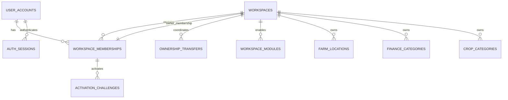
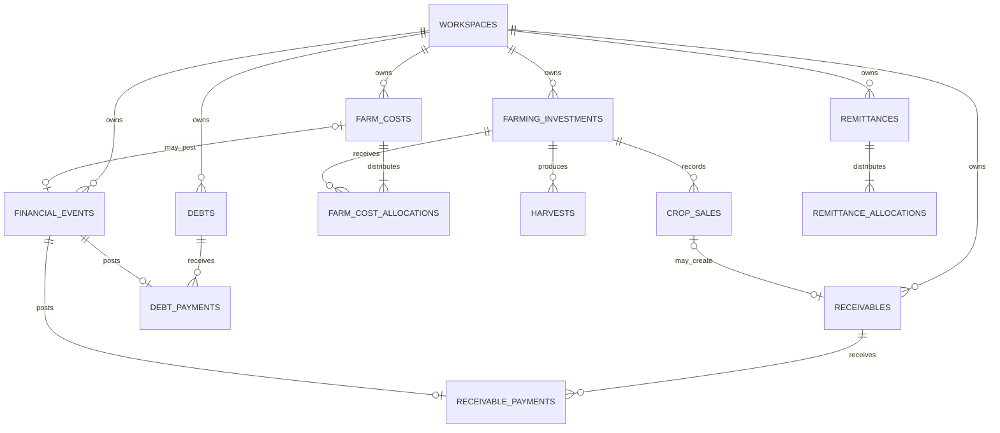
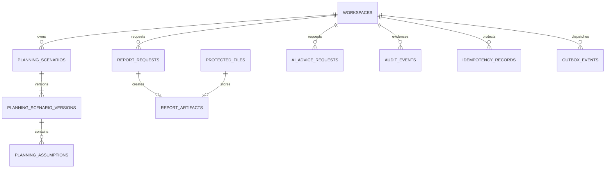

# F2S Relational Database Design

## 1. Purpose and scope

This document defines the conceptual PostgreSQL relational model for F2S: module ownership, relationships, cardinality, workspace isolation, lifecycle, historical preservation, constraints, indexes, timestamps, sensitive data, canonical financial events, units, and transaction boundaries.

It follows [ADR-001](adr/ADR-001-modular-monolith.md), [ADR-002](adr/ADR-002-use-postgresql.md), [ADR-008](adr/ADR-008-safe-financial-numeric-storage.md), [ADR-012](adr/ADR-012-workspace-level-data-isolation.md), [ADR-013](adr/ADR-013-workspace-ownership-and-membership.md), and the [System Architecture](07_System_Architecture.md). It creates no SQLAlchemy model, Alembic migration, SQL, API contract, seed data, or database resource.

## 2. Design principles

1. PostgreSQL is one initial physical database; every table/migration has one logical module owner.
2. Every workspace-protected row, including child/join/job/artifact rows, stores direct non-null `workspace_id`.
3. Protected parent-child relationships include `workspace_id` in composite foreign keys so cross-workspace references fail in PostgreSQL.
4. UUID primary keys are opaque and never substitute for authorisation.
5. Canonical financial events are immutable postings; corrections append reversal/replacement facts.
6. Calculation owns derived financial results; SQL, reports, frontend, and AI do not duplicate formulas.
7. Money, rates, ratios, quantities, currencies, units, and rounding follow ADR-008.
8. Cancellation, archive, reversal, expiry, and deactivation have distinct meanings; generic hard deletion is not a lifecycle.
9. Constraints defend local invariants; application transactions enforce cross-row/module invariants.

## 3. Common conventions

| Concern | Convention |
| --- | --- |
| Names | Lowercase `snake_case`; plural tables; no quoted mixed-case identifiers |
| Primary key | `id UUID`, application-generated cryptographically random UUID v4 |
| Ownership | `workspace_id UUID NOT NULL` on every workspace-protected row |
| Instants | UTC `TIMESTAMPTZ`; workspace timezone is display/period context |
| Calendar facts | `DATE` where time-of-day is not intended |
| Concurrency | `version BIGINT NOT NULL`, initially `1` on mutable aggregates |
| Money | `NUMERIC(24,4)` plus required `currency_code` |
| Exchange rate | `NUMERIC(24,12)` plus explicit source/destination currencies |
| Ratio | `NUMERIC(18,10)`, where `0.15` means 15 percent |
| Quantity | `NUMERIC(24,8)` plus required compatible `unit_code` |
| Unit price | `NUMERIC(24,8)` plus currency/unit context |
| Lifecycle | Stable uppercase bounded text code; PostgreSQL enum is not the default |
| Flexible data | Relational fields by default; bounded validated `JSONB` needs justification |

Protected mutable rows use applicable `created_at`, `created_by_membership_id`, `updated_at`, `updated_by_membership_id`, and `version`. Explicitly archivable rows add `archived_at`, `archived_by_membership_id`, and `archive_reason`. There is no universal `deleted_at`.

## 4. Workspace isolation

Every protected parent has uniqueness on `(workspace_id, id)`. Child relationships use a composite key such as:

`(workspace_id, farming_investment_id) -> farming_investments(workspace_id, id)`

Protected repositories require `AuthorisationContext` and include workspace scope in every list, read, write, archive, aggregate, and relationship lookup. `find_by_id(id)` without workspace scope is prohibited for business records. Background jobs, reports, files, audit queries, and AI preparation revalidate scope.

`user_accounts`, credential challenges, and `auth_sessions` are identity-scoped because one account may belong to multiple workspaces or none during activation. They are not ordinary workspace-query data. Protected access requires an Active `workspace_membership` and explicit selected-workspace context. Row-level security may later add defence in depth but never replaces backend policy/scoped repositories.

## 5. Relationship views

A financial event may reference one earlier financial event through `reverses_financial_event_id`. Under the initial correction policy, an original event may have at most one effective reversal. This self-reference is described in text because rendering the same entity twice makes the ER view appear symmetric and obscures the two roles.

## 6. Entity catalogue: identity and workspace

| Entity / owner | Purpose and key fields | Constraints, lifecycle, indexes, isolation |
| --- | --- | --- |
| `bootstrap_state` / Identity | Serialized one-time installation guard; completion timestamp and safe evidence | Singleton/strong uniqueness; locked during bootstrap; ordinary reset prohibited |
| `user_accounts` / Identity | Global normalized-email login identity; account state, password digest, profile, language/timezone, version | Unique normalized email; `PENDING_ACTIVATION/ACTIVE/SUSPENDED/LOCKED/CLOSED`; Restricted; historical references retained |
| `auth_sessions` / Identity | Opaque access/refresh lifecycle; user, credential digests, family, issue/idle/absolute expiry, revoke/reuse metadata | Raw credentials absent; digests unique; account/expiry/family indexes; rotation and reuse revocation atomic |
| `activation_challenges` / Identity | Membership activation evidence; digest, issue/expiry/use/revoke metadata | Raw value absent; single-use; restart revokes earlier challenges; bounded retention |
| `recovery_challenges` / Identity | Concealed account-recovery evidence | Raw value absent; single-use, expiring, rate-limited; successful recovery revokes required sessions |
| `workspaces` / Workspace Access | Stable tenant boundary; name, type, base currency, timezone, language, optional profile, owner membership reference, status/version | Type is `HOUSEHOLD/FARM/MICROBUSINESS/SMALL_BUSINESS/COMBINED/CUSTOM`; same-workspace owner FK; exactly one Active Admin owner |
| `workspace_memberships` / Workspace Access | Account-workspace role and lifecycle | Unique `(workspace_id,user_account_id)`; roles `ADMIN/CONTRIBUTOR/ADVISOR`; states `PENDING/ACTIVE/SUSPENDED/REVOKED`; no second Admin in MVP; historical actors retained |
| `workspace_modules` / Workspace Access | Explicit validated enabled-module configuration | Unique workspace/module code; Admin-only and audited; type supplies defaults but is not authoritative after configuration |
| `ownership_transfers` / Workspace Access | Dedicated current-owner/target confirmation lifecycle | Same-workspace memberships; digest-stored challenge; initiated/confirmed/cancelled/expired/completed; completion locks and moves owner atomically |
| `farm_locations` / Workspace Access | Workspace farm/location reference | Workspace-normalized active name/code uniqueness; archivable; historical references remain |
| `finance_categories` / Finance | Workspace finance classification | Workspace-normalized active uniqueness; archivable; same-workspace references |
| `crop_categories` / Farming | Reusable crop classification | Workspace-normalized active uniqueness; category action never creates project; archivable |

Password hashes/recovery material are purpose-specific security records finalized by Issue #11; raw credentials/tokens never persist.

### 6.1 Implemented Phase 1 schema revisions

Revision `20260809_0001` creates `bootstrap_state`, `user_accounts`, `workspaces`, `workspace_memberships`, and `workspace_modules`. The physical owner reference uses a deferred composite foreign key from the workspace ID, owner membership ID, constant `ADMIN` role, and constant `ACTIVE` membership status to the matching membership row. This permits atomic creation with pre-generated UUIDs while rejecting a cross-workspace, inactive, or non-Admin owner at commit. A partial unique index permits at most one Active Admin membership per workspace.

Revision `20260809_0002` adds `auth_sessions`, `activation_challenges`, `recovery_challenges`, `ownership_transfers`, and `audit_events`. Bearer and confirmation values exist only as purpose-separated digests. Rotation generations share a session family and retain single-child lineage for reuse detection. Activation binds the workspace, membership, and account through one composite foreign key. Both transfer memberships are constrained to the transfer workspace. Audit stores explicit bounded codes and references rather than an unvalidated metadata payload; global identity events have no workspace, while workspace events require one.

The application services remain responsible for atomic rotation, lifecycle transitions, transfer locking/completion, append-only audit writes, retention, and authorization. These behaviors are not implied merely by the schema.

## 7. Canonical finance model

### 7.1 `financial_events`

This is the canonical cash event table. A real inflow/outflow appears once even when initiated by household finance, farming, remittance, debt, or receivable workflows.

Key fields: UUID/workspace/actor/timestamps; `event_kind`; separate `cash_direction` (`INFLOW`/`OUTFLOW`); `occurred_on`; optional household-domain finance category; positive `amount`; currency; payment-method code; bounded counterparty/source/reference/notes; approval `record_status` (`PENDING/APPROVED/REJECTED`) and posting state; optional same-workspace `reverses_financial_event_id` and `replacement_for_financial_event_id`; idempotency/operation evidence.

Rules:

- Only `APPROVED` events contribute to official datasets; Contributor submissions begin `PENDING`.
- Approved amount, currency, direction, and occurrence date are immutable.
- Reversal is a new opposite event in the same workspace/currency; it cannot reference itself.
- Original history remains; an approved replacement is a separate posting.
- Domain payment/cost rows store one required unique `financial_event_id`; same-workspace composite FKs and uniqueness prevent duplicate counting.
- An unenforced polymorphic source pair is never the only relationship.
- Indexes: `(workspace_id, occurred_on DESC, id)`, workspace/status/kind/date, category/date, payment-method/date, and workspace/correction links.

`financial_event_files` joins events to `protected_files` with workspace, attachment role, add/remove evidence, and active-link uniqueness.

## 8. Entity catalogue: farming and funds

| Entity / owner | Key content | Critical rules and indexes |
| --- | --- | --- |
| `farming_investments` / Farming | Crop, season, year, location, planting cycle, field size/unit, dates, planned budget/currency, notes, lifecycle/version | `PLANNED/ACTIVE/HARVESTING/COMPLETED/CANCELLED/ARCHIVED`; valid dates/positive field/non-negative budget; cancellation reason; same-workspace crop/location; indexes workspace/status/year, crop/season/year, location/year |
| `farm_costs` / Farm Ops | Cost date/category/description, total money, optional unique canonical event | Positive cost; same-workspace event; correction preserves history |
| `farm_cost_allocations` / Farm Ops | Cost, investment, basis, ratio, allocated money, stable residual key | Unique cost/project; parents in same workspace; shares conserve total; percentage sums `1.0` transactionally |
| `harvests` / Farm Ops | Project/date, quantity/unit, loss, quality, storage, notes/version | Non-negative compatible quantities; loss <= total; project/date indexes; derived usable/loss ratio not editable |
| `crop_sales` / Farm Ops | Project/date, buyer ref, quantity/unit, unit price/currency, gross revenue, payment state | Positive quantity/price; source-or-derived gross authority documented; cash derived from payments; at most one primary sale receivable; project/date/payment indexes |
| `remittances` / Funds | Source/destination money, destination-per-source rate, FX authority mode, fee/date/method, protected sender/receiver, canonical links | Positive/reconciled values; `QUOTED_RATE/SETTLED_AMOUNT`; same-workspace event links |
| `remittance_allocations` / Funds | Remittance, purpose, optional target, ratio/amount/residual evidence | Purposes Household/Farm/Education/Debt/Savings/Other; exact reconciliation; no duplicate income |
| `debts` / Funds | Lender ref, original principal/currency, interest basis/rate, dates, purpose/collateral notes, state/version | `ACTIVE/PAID/DEFAULTED/CANCELLED/ARCHIVED`; balance derived; workspace/status/due index |
| `debt_payments` / Funds | Debt, unique canonical event, date, principal/interest/fee split, correction state | Components reconcile; same workspace; no silent negative balance; debt/date index |
| `receivables` / Funds | Optional unique sale, debtor ref, original money, recognised/due dates, state/version | `OPEN/PARTIALLY_PAID/PAID/OVERDUE/WRITTEN_OFF/CANCELLED/ARCHIVED`; outstanding derived; status/due index |
| `receivable_payments` / Funds | Receivable, unique canonical event, date, correction/reversal state | Same workspace/currency unless explicit FX; overpayment explicit; receivable/date index |

Cross-row allocation/balance invariants are enforced inside the owning transaction and tested. A deferred database trigger may later add defence if it does not violate module ownership.

## 9. Planning, reporting, AI, and evidence entities

| Entity / owner | Design |
| --- | --- |
| `planning_scenarios` / Planning | Workspace-owned named scenario, optional crop/location, `DRAFT/ACTIVE/ARCHIVED`, actor/timestamps/version; never creates real project/event |
| `planning_scenario_versions` / Planning | Immutable version with period, source snapshot refs, currency/unit, scenario inputs, quality/rule versions, creator/time |
| `planning_assumptions` / Planning | Version-owned typed assumption rows with code, value, currency/unit, provenance, uncertainty; no unvalidated JSON blob |
| `protected_files` / File Protection | Storage key, safe names, purpose, media type, bytes, checksum, sensitivity, `PENDING/AVAILABLE/QUARANTINED/EXPIRED/DELETED/FAILED`, expiry; storage key never user filename |
| `report_requests` / Reporting | Actor, type, period, authorised filters/dataset version, format, state/times/correlation/error; `QUEUED/RUNNING/SUCCEEDED/FAILED/CANCELLED/EXPIRED` |
| `report_artifacts` / Reporting | Request, protected file, renderer/version, checksum validation, expiry/state; partial file never available |
| `ai_advice_requests` / AI | Safe request metadata only: purpose, dataset version, language, quality, model, state, size/cost/times/correlation/error; no unmasked prompt/prohibited content |
| `audit_events` / Audit | Append-only workspace/actor/action/resource/result/time/correlation/module/safe metadata; no secret/full payment/unmasked AI; indexed by workspace/time, action, actor, resource, correlation |
| `idempotency_records` / Support | Workspace/operation/key, request fingerprint, state/result ref/expiry; unique workspace+operation+key; changed fingerprint rejected; current auth rechecked |
| `outbox_events` / Support | Minimal post-commit intent, schema version, safe payload, `PENDING/PROCESSING/SUCCEEDED/FAILED/DEAD_LETTER/CANCELLED`, attempts/next time/correlation |

Persisted calculated/scenario result snapshots, if later approved, are immutable and carry source snapshot, formula version, precision/rounding, currency/unit, period, availability, quality, and calculation time.

## 10. Ownership/isolation register

Every workspace-protected entity below has direct `workspace_id`; all protected relationships repeat it in composite FKs.

| Module | Direct workspace-protected entities |
| --- | --- |
| Workspace Access | workspaces, memberships, modules, ownership transfers, locations |
| Household Finance | finance categories, financial events, financial-event files |
| Farming Investments | crop categories, farming investments |
| Farm Operations | farm costs, cost allocations, harvests, crop sales |
| Funds and Obligations | remittances/allocations, debts/payments, receivables/payments |
| Analytics and Planning | planning scenarios, versions, assumptions |
| File Protection | protected files |
| Reporting | report requests, report artifacts |
| AI Advice | AI advice requests |
| Audit | audit events |
| Application Support | idempotency records, outbox events |

Global `user_accounts`/`auth_sessions` use the controlled Identity boundary described in Section 4. Adding an entity without an ownership/isolation entry is prohibited.

## 11. Historical preservation and delete behavior

| Relationship/action | Rule |
| --- | --- |
| Workspace to protected history | Restrict deletion; archive workspace |
| Membership to business/audit actor | Restrict; deactivate membership |
| Category/location to history | Restrict; archive reference |
| Investment to cost/harvest/sale | Restrict; cancel/archive project |
| Financial event to domain source | Restrict; append reversal/replacement |
| Sale to receivable; debt/receivable to payment | Restrict; coordinated cancellation/correction/reversal |
| Report/file bytes | Retention may delete bytes after expiry while minimal request/audit metadata remains |
| Session/challenge/idempotency/outbox | Policy deletion after security/retry window if no historical dependency |

`ON DELETE CASCADE` is prohibited for workspace financial, farming, payment, and audit history. It is allowed only for a truly private non-historical child whose parent deletion and retention are explicitly approved.

## 12. Constraint catalogue

Database-enforced: required ownership/IDs/timestamps/context; bounded codes; numeric ranges/scale; date ordering; same-workspace composite FKs; unique memberships/credential digests/idempotency/domain-event links/sale receivable; reversal not self; protected file size/expiry; owner membership belongs to the same workspace.

Application-transaction enforced: exactly one Active Admin owner; no second Admin in MVP; atomic bootstrap and ownership transfer; capability and approval rules; farming transitions; allocation conservation; FX triplet agreement; sale/revenue/cash/receivable reconciliation; debt/receivable overpayment policy; valid reversal chain; calculation quality/availability; required audit and cross-module rows commit together.

## 13. Index strategy

Indexes support named authorised queries, constraints, or operations:

- unique `(workspace_id,id)` for protected relationships;
- active lists `(workspace_id,status,updated_at DESC,id)` or justified partial index;
- finance/audit `(workspace_id,occurred_on/occurred_at DESC,id)`;
- obligations `(workspace_id,status,due_date,id)`;
- child histories `(workspace_id,parent_id,event_date DESC,id)`;
- retry work `(state,next_attempt_at,id)` plus workspace lookup;
- expiry cleanup `(status,expires_at,id)`;
- correlation investigation with workspace/time.

Avoid speculative/redundant indexes, low-selectivity status-only indexes, sensitive free-text indexes, and global uniqueness where uniqueness is workspace-specific. Validate query plans against the reference dataset.

## 14. Currency, units, derived data, and time

- Currency/unit codes come from controlled registries; each amount/quantity retains context.
- Unit registry records dimension and versioned exact conversion; incompatible dimensions never calculate together.
- Source value/unit remain historical; normalized comparison values are derived.
- `0` is verified zero; missing/unavailable uses null plus explicit state/reason.
- Instants are UTC `TIMESTAMPTZ`; business calendar facts use `DATE`; workspace timezone defines display/period boundaries without rewriting history.
- User occurrence date differs from server `created_at`; audit ordering uses server-controlled time.

## 15. Sensitive data and retention

| Classification | Examples | Baseline |
| --- | --- | --- |
| Public | Repository documentation | No protected workspace data |
| Internal | Safe codes/operational metadata | Need-to-know |
| Confidential | Workspace/location/transaction/buyer/lender/report metadata | Workspace-authorised, protected backups, masked logs |
| Restricted | Login/contact, token digest, bank/payment details, attachments, unmasked AI source | Strongest least privilege, purpose limitation, minimal retention/redaction |

Every implemented field must record purpose, classification, audience, retention owner, and export/AI/log rule. Legal periods remain deferred. Financial/farming history is not removed through ordinary actions; session/challenge/job/file/AI metadata is minimized. Backups have protected independent retention.

## 16. Core transaction boundaries

| Use case | Atomic rows |
| --- | --- |
| Farm cost | Cost, complete allocations, canonical event, audit, idempotency outcome |
| Sale receipt | Receivable payment, canonical event, sale/receivable effects, audit, idempotency |
| Debt payment | Debt payment, canonical event, version/state effect, audit, idempotency |
| Remittance | Remittance, complete allocations, approved canonical event links, audit, idempotency |
| Project cancel/archive | Lifecycle state/reason/history and audit; linked facts unchanged |
| Consequential setting/role | New state/version and audit; no partial authority change |

Email, report rendering, and Gemini run after core commit through explicit request/outbox states and cannot roll back committed financial facts.

## 17. Migration and validation governance

Migrations declare module owner, issue, compatibility, validation, and rollback/restore approach. Clean and representative prior databases must reach the same schema. Destructive changes require reconciliation, protected backup, lock/capacity analysis, and recovery evidence. Seed/sample real workspace finance data is prohibited.

Required validation covers cardinality; two-workspace isolation for every entity; duplicate/concurrent/stale/timeout cases; atomic bootstrap and ownership transfer; cancellation/archive/reversal/deactivation preservation; ADR-008 boundaries; constraint layers; named-query plans; field classification/log/export/AI review; migration reconciliation; and restored-database isolation/financial totals.

## 18. Deferred and acceptance

Deferred: physical models/migrations/SQL; REST contracts; credential/token schema detail; report/AI retention; RLS syntax; partitioning/replicas/HA; PostgreSQL version; legal retention/anonymisation.

Issue #8 is satisfied when every protected entity has an isolation rule, global identity has a controlled boundary, relationships/cardinality/lifecycle/constraints/indexes/UUIDs/timestamps/archive are explicit, canonical links prevent duplicates, accepted numeric/unit ADRs govern values, sensitive/retention limits are identified, and no implementation artifacts are added.
