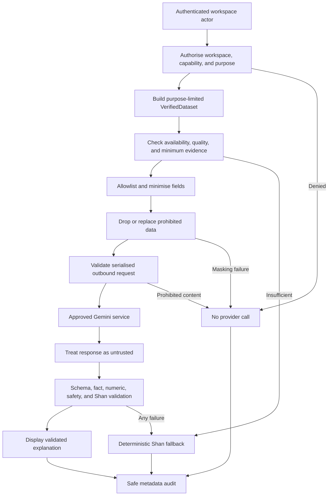

# F2S Verified-Data and Sensitive-Masking AI Design

## 1. Purpose and status

This document defines the future F2S AI-advice boundary: permitted explanations, verified input, data minimisation, deterministic masking, provider isolation, prompt-injection controls, structured output, response validation, Shan-language behavior, safe fallback, audit, retention, testing, and release governance.

It follows the [Product Requirements](02_Product_Requirements.md), [Functional Requirements](03_Functional_Requirements.md), [System Architecture](07_System_Architecture.md), [Database Design](08_Database_Design.md), [REST API Design](09_API_Design.md), [Security Design](15_Security_Design.md), [Test Strategy](17_Test_Strategy.md), and [Data Dictionary](21_Data_Dictionary.md).

This document creates no Gemini call, prompt text, endpoint, database model, migration, UI, secret, provider account, or application code. Exact API schemas, prompts, model choice, provider commercial terms, and production configuration require later implementation decisions and ADR-006.

## 2. Non-negotiable principles

1. F2S calculations and source-module facts remain authoritative; AI only explains already verified results.
2. AI never originates, corrects, ranks, approves, or persists a financial value, forecast, recommendation, or workspace action.
3. AI receives only a purpose-limited, workspace-authorised, quality-labelled dataset assembled by F2S.
4. Data minimisation happens before masking. A field not required for the approved purpose is removed, not merely obscured.
5. Prohibited data never enters the outbound request, including hidden prompt sections, metadata, filenames, logs, traces, or retry records.
6. The provider, its safety filters, and its response are untrusted. F2S validates every response independently before display.
7. A model cannot call tools, browse URLs, query F2S tables, execute actions, or mutate source data.
8. Provider credentials remain backend-only and are never placed in frontend code, browser storage, the database, prompts, logs, or repository files.
9. Raw provider requests and responses are not persisted by F2S. Safe request metadata follows the existing 90-day provisional retention rule.
10. Any failure or uncertainty produces a deterministic, localised fallback without changing financial or farming records.

## 3. Provider baseline and terms gate

Gemini is an external processor, not a trusted F2S component. Before each environment may call it, the delivery owner must approve and record:

- the exact service, paid or unpaid tier, model identifier, API version, and region;
- provider use of submitted/generated content, human review, training or product-improvement use;
- retention, deletion, subprocessors, data residency, transfer, and incident obligations;
- applicable terms, privacy agreement, organisational controls, billing and quota;
- model deprecation and compatibility dates; and
- a disable/rollback owner and kill-switch procedure.

Production workspace data must not use a service tier whose terms permit provider product improvement or human review of submitted content. Google currently warns that unpaid-service content may be used for improvement and reviewed by humans; therefore an unpaid Gemini service is prohibited for production F2S. If an approved arrangement cannot meet F2S privacy and retention constraints, AI advice remains disabled.

Provider controls supplement rather than replace F2S controls. Google documents adjustable safety settings and safety feedback, but F2S still performs its own data-loss, factual, structural, language, and policy validation. Structured JSON output constrains syntax only; it does not prove that an explanation is true.

The following official sources are review inputs, not frozen contractual facts:

- [Gemini API Additional Terms of Service](https://ai.google.dev/gemini-api/terms)
- [Gemini API safety settings](https://ai.google.dev/gemini-api/docs/safety-settings)
- [Safety and factuality guidance](https://ai.google.dev/gemini-api/docs/safety-guidance)
- [Structured outputs](https://ai.google.dev/gemini-api/docs/structured-output)
- [Gemini API key guidance](https://ai.google.dev/gemini-api/docs/api-key)

The terms and configuration review occurs before first integration, before production, at least quarterly, and whenever the provider, tier, model, region, or terms change.

## 4. Ownership and trust boundaries

| Owner | Owns | Must not own |
| --- | --- | --- |
| Source modules | Authoritative workspace-scoped finance, farming, funds, and planning records | AI prompts, provider behavior, or advisory prose |
| Calculation and Data Quality | Exact formulas, decimal/rounding/unit policy, availability, quality and rule versions | AI prose or provider calls |
| Query and Dashboard | Authorised, purpose-limited `VerifiedDataset` composition | Provider adaptation or source mutation |
| AI Advice | Purpose validation, minimisation, masking, outbound schema, provider adapter, response validation, fallback and safe metadata | Source-table access, authoritative calculation, financial action, or unmasked payloads |
| Secrets and Configuration | Provider secret, approved model/tier/region, budgets and kill switch | Business records or prompt contents |
| Audit | Append-only safe request/result evidence | Raw prompts, provider responses, or prohibited data |
| UI | Request/status/fallback display and accessible Shan presentation | Provider credentials, calculations, masking, or response trust decisions |

The external provider is outside the F2S trust boundary. Network encryption protects transport but does not make the provider or its output authoritative.

## 5. Initial permitted purposes

AI advice is not a general chat surface. Each request selects one server-owned purpose code with its own dataset schema, capability, size budget, output schema, and validation policy.

| Purpose code | Permitted result | Prohibited expansion |
| --- | --- | --- |
| `EXPLAIN_VERIFIED_SUMMARY` | Explain named verified totals, period and quality | New totals, financial decisions, arbitrary records |
| `EXPLAIN_VERIFIED_VARIANCE` | Explain backend-supplied comparison factors | Independent causal claim or recalculation |
| `EXPLAIN_DATA_QUALITY` | Explain missing, incomplete, stale or unavailable data | Inferring missing values or identities |
| `EXPLAIN_FORECAST_ASSUMPTIONS` | Explain an approved deterministic scenario and uncertainty | Creating a forecast, guarantee, ranking or investment instruction |

Initial release excludes open-ended chat, tax/legal/medical advice, guaranteed outcomes, lending decisions, autonomous recommendations, arbitrary source search, provider web grounding, URL retrieval, function calling, file upload, image input, and transaction execution. Adding a purpose is a reviewed contract change, not a free-text flag.

## 6. End-to-end control flow

The required sequence is:

1. validate the current server-side session;
2. resolve the selected workspace and Active membership;
3. authorise the named AI capability and purpose;
4. enforce rate, concurrency, idempotency and request-size limits;
5. obtain a versioned `VerifiedDataset` through the Query/Dashboard contract;
6. reject unsupported, unavailable or insufficient-quality input before a provider call;
7. select only the purpose schema's allowlisted facts, forecasts, assumptions and quality fields;
8. minimise, replace and scan prohibited content;
9. serialise and revalidate the exact outbound bytes;
10. call only the approved backend provider configuration;
11. validate the complete response before any part is displayed; and
12. return validated content or a deterministic fallback and write safe audit metadata.

## 7. Conceptual internal request contract

The AI module consumes a purpose-specific `AdvisoryDataset`, derived from but narrower than a `VerifiedDataset`. It contains only:

- schema, dataset, formula, rule, masking-policy and prompt-policy versions;
- purpose code, requested supported locale, workspace timezone, period and generation time;
- stable request-local synthetic entity labels when relationships are necessary;
- verified fact identifiers with exact decimal strings, currencies, units and periods;
- separately labelled forecast values with scenario/version, assumptions and uncertainty;
- availability and data-quality classifications, missing fields and safe limitations; and
- source references that are opaque F2S dataset item identifiers, never source-table keys or provider-accessible URLs.

It never contains direct database rows, ORM objects, user-controlled instructions, arbitrary JSON, HTML, credentials, source-table names, internal paths, or fields outside the selected purpose schema.

Exact money, quantity, rate and ratio values remain strings under ADR-008. Provider output cannot modify them. The request carries no model-generated input disguised as verified data.

## 8. Prohibited data inventory

| Category | Examples | Outbound rule |
| --- | --- | --- |
| Identity | Person name, username, date of birth, government identifier, signature | Remove; use a request-local role label only if necessary |
| Contact | Email address, phone number, messaging handle | Remove |
| Location | Street/address, precise village/plot address, GPS, precise coordinates | Remove; only an approved coarse non-identifying category may remain |
| Payment and banking | Account/card/wallet number, bank details, payment routing data | Remove |
| Transaction reference | Receipt number, transfer reference, provider reference, bank narration | Remove or replace with request-local opaque label only when relationship is essential |
| Authentication | Password, password hash, token, cookie, session/CSRF value, recovery/activation proof | Reject the whole outbound request and raise a security signal |
| Secret/configuration | API key, signing/encryption key, connection string, secret environment value | Reject and raise a security signal |
| Internal identifier | Workspace/user/member UUID, database key, storage key, correlation ID | Remove; provider request uses unrelated request-local labels |
| Free text | Notes, descriptions, buyer/lender/sender text, filenames, attachment contents | Deny by default; never send raw |
| Operational internals | Stack trace, SQL, host/path, logs, source code, infrastructure names | Remove |
| Unnecessary business data | Any fact not required by the selected purpose | Remove before masking |

Sensitive-field aliases and nested paths are versioned in the masking policy. Unknown fields fail closed.

## 9. Minimisation and masking pipeline

### 9.1 Structured allowlisting

The purpose schema builds a new object from approved typed fields; it never copies an incoming/source object and deletes known bad keys. Unknown, additional, duplicate, malformed or over-depth fields are rejected. Free text is absent from initial purpose schemas.

### 9.2 Request-local replacement

When an entity relationship is necessary, F2S replaces identity with a neutral label such as `INVESTMENT_1`, `CROP_CATEGORY_1` or `PERIOD_1`. Labels are deterministic only within one request and purpose. The mapping:

- uses cryptographically random request-local salt where derivation is needed;
- cannot be linked across requests, workspaces or purposes;
- is held in memory only and never sent, logged or persisted; and
- does not encode a source identifier, name, order that reveals identity, or reversible value.

Masking is not encryption and does not justify sending unnecessary data.

### 9.3 Exact-payload inspection

After serialisation and immediately before transport, F2S validates the exact bytes against:

- the strict purpose schema and maximum depth/count/byte/token budgets;
- prohibited key names and classified field paths;
- secret, credential, contact, payment, reference, UUID and location patterns;
- seeded canary values used in tests;
- disallowed free text, control characters, markup, URLs and instruction-like fields; and
- the approved locale, model, schema and policy versions.

Any match rejects the request before network transmission. Detection logs only category, policy version and correlation-safe metadata—not the matched value.

## 10. Prompt-injection boundary

Workspace-controlled content, imported data and provider output are untrusted data, even when stored in an authorised F2S record.

- Initial schemas send no arbitrary workspace free text.
- Server-owned instructions are fixed, versioned and outside user-editable fields; this document defines policy, not actual prompt text.
- Structured data is placed only in the designated data field and cannot change purpose, schema, tools, audience or system policy.
- The provider has no tools, functions, browsing, retrieval, URL access, database connection or action endpoint.
- Instructions found in data or output are treated as content and rejected when they attempt policy override, secret disclosure, tool use or action.
- Provider output is never recursively placed into a new provider request without a new authorised, minimised and validated contract.
- HTML, scripts, executable Markdown, remote images and provider-generated links are prohibited in initial output.

## 11. Provider request controls

The backend provider adapter supplies an approved explicit model identifier/version, API version, structured output schema, low-variance generation settings, maximum input/output budgets, timeout, safety settings and correlation-safe provider request identifier. All values are centrally configured and versioned.

Initial operational limits are provisional until measured with the approved model:

- maximum 8,000 provider input tokens per request;
- maximum 1,000 provider output tokens;
- 15-second per-attempt timeout and 30-second total provider budget;
- at most one retry for a retryable `429` or transient `5xx`, only when duplicate generation is safe; and
- no automatic retry for validation, safety, authentication, permission, malformed-request or content-policy failure.

Existing security limits remain authoritative: 5 AI requests per actor per 10 minutes, 20 per workspace per hour, and at most 1 concurrent request per actor. Cost, token and provider quotas can lower these limits but cannot weaken them.

Secrets are loaded through the approved production secret mechanism. Requests use HTTPS with certificate validation. The adapter must not accept a user-selected model, base URL, system instruction, safety setting, or API key.

## 12. Conceptual response contract

The provider returns one strict, versioned object with no unknown fields. The conceptual content is:

- `language_code`, initially `shn`;
- `summary`;
- `fact_explanations`, each referencing one or more allowed verified fact identifiers;
- `forecast_explanations`, each referencing an allowed scenario and its assumptions;
- `limitations`;
- `missing_information`;
- `warnings`; and
- `source_references`, restricted to identifiers present in the advisory dataset.

The response has no executable command, recommendation/action field, provider URL, HTML, model-selected confidence score, revised total, hidden reasoning, raw prompt echo, or arbitrary metadata. F2S does not request or retain chain-of-thought.

## 13. Response validation

No streaming token or partial field is displayed. The complete provider response passes all checks:

1. expected transport status, size, encoding and content type;
2. provider safety result and finish reason permit use;
3. strict JSON parsing and the exact versioned schema, with unknown fields rejected;
4. requested language code and Shan-language policy;
5. every referenced fact, forecast and assumption exists in the outbound advisory dataset;
6. every number, date, currency, unit, percentage and period exactly matches an allowed supplied value and context;
7. facts, forecasts, assumptions, uncertainty, missing data and limitations remain distinctly labelled;
8. no fabricated causal claim, guarantee, authoritative advice, ranking, calculation, data correction or action instruction;
9. no prohibited identity, contact, payment, reference, secret, internal identifier, prompt echo or provider-only detail;
10. no injection attempt, URL, HTML, executable markup or unsafe display content; and
11. configured length, item-count, repetition and readability constraints.

Numeric matching is deterministic and token-aware; a number appearing elsewhere in the dataset does not authorise it in an unrelated statement. Formatting changes that alter value, currency, unit, period, sign, precision or fact/forecast status are rejected.

Provider JSON-schema enforcement and safety feedback do not satisfy semantic validation. F2S owns the final allow/deny decision.

## 14. Shan-first behavior

The initial explanation locale is Shan (`shn`). All UI status, fallback, validation and limitation text uses reviewed F2S translation keys. Before Shan AI output is enabled:

- representative safe and adversarial datasets receive native-speaker review;
- required financial, farming, uncertainty and missing-data terminology is approved;
- language identification and script checks reject clearly wrong-language output without claiming perfect detection;
- mixed-language numeric/currency/unit presentation follows the UI/UX and data-dictionary rules; and
- unsupported or invalid Shan output is discarded entirely and replaced by the reviewed Shan fallback.

F2S does not silently show English provider output when Shan validation fails. Language quality evidence is a release gate, not an assumption based on model capability claims.

## 15. Request lifecycle and API expectations

The established AI lifecycle remains:

| State | Meaning |
| --- | --- |
| `VALIDATING` | Authentication, authorisation, purpose, dataset, quality and limits are being checked |
| `MASKED` | Minimised payload passed deterministic masking and exact-payload inspection |
| `SENT` | Provider request was attempted; no response is trusted yet |
| `SUCCEEDED` | Complete response passed every F2S validation and may be displayed |
| `FALLBACK` | Safe deterministic response replaces absent, unsafe or invalid AI output |
| `FAILED` | Request cannot safely produce either approved output or fallback |
| `CANCELLED` | Cancellation was accepted; a provider call already in flight may only be best-effort cancelled |

Future `/api/v1/workspaces/{workspace_id}/ai-advice-requests` behavior follows the REST API design: authenticated workspace scope, capability, strict fields, idempotency, safe `202` asynchronous request resource, authorised status access, rate limiting and best-effort cancellation. Exact endpoint schemas remain deferred.

A timeout or cancellation never changes source records. If a provider call completes after cancellation, its output is discarded and not displayed.

## 16. Failure and fallback policy

| Condition | Provider contacted? | Result |
| --- | --- | --- |
| Unauthenticated, unauthorised or wrong workspace | No | Safe denial; no existence or data leak |
| Unsupported purpose/locale or invalid request | No | Safe validation failure |
| Insufficient/unavailable dataset | No | Reviewed deterministic explanation of missing data |
| Masking, canary or outbound-schema failure | No | Fail closed, safe security/operational signal |
| Rate/concurrency/budget limit | No | Safe `429`/status with retry guidance where known |
| Provider timeout, rate limit or outage | Possibly | Deterministic fallback; bounded retry only as allowed |
| Provider safety block or malformed response | Yes | Discard full response; deterministic fallback |
| Fabricated/mismatched value or source reference | Yes | Discard full response; deterministic fallback and validation metric |
| Wrong language, guarantee, advice or injection content | Yes | Discard full response; deterministic fallback |
| Required audit cannot be completed | Possibly | Do not publish AI output; fallback/failure and operational alert |

Fallback content is generated from server-owned Shan translation templates and verified availability/quality fields only. It does not call another model, make new calculations, imply success, or expose internal failure details.

## 17. Persistence, logging, audit and retention

`ai_advice_requests` stores safe request metadata only: workspace/actor references, purpose, dataset/formula/quality/masking/schema/prompt-policy versions, requested language, approved model/service identifiers, lifecycle state, input/output size and token counts, cost class, times/duration, safe result/error category and correlation identifier.

F2S does not persist:

- the raw or masked outbound prompt/provider payload;
- the raw or validated provider response;
- request-local replacement mappings;
- prohibited matched values, provider credentials or safety-filter text; or
- workspace facts duplicated solely for AI.

Because AI result content is not retained, the initial asynchronous contract must deliver a validated result through an approved ephemeral mechanism and must not promise later content retrieval. The implementation issue must reconcile delivery/retry behavior before finalising its API; only safe status and metadata remain available afterward.

Safe AI metadata has the existing provisional 90-day retention. Raw request/response payload retention is zero within F2S. Provider-side retention is separately governed by the terms gate in Section 3.

Audit records actor, workspace, purpose, dataset/version references, model/service and policy versions, state transitions, timing, result category, fallback reason category and correlation. Logs/metrics may include the same safe categories plus latency, token counts and cost class. They never include prompt/response bodies, workspace values, replacement mappings, provider keys or matched sensitive strings.

## 18. Monitoring, cost and incident controls

Required aggregate signals include request/state counts, pre-provider rejection categories, masking failures, provider latency/status, safety blocks, response-validation categories, Shan fallback rate, token/cost budgets, retries, cancellation and audit failure. Dimensions are bounded and contain no workspace content.

Alerts cover abnormal sensitive-pattern rejection, validation/fallback spikes, quota/cost acceleration, provider authentication failure, terms/model configuration drift and kill-switch activation. A suspected outbound disclosure triggers provider access disablement, credential rotation where relevant, evidence preservation without copying sensitive payloads, and the security incident process.

The kill switch can disable all AI or one purpose/model without disabling core finance, farming, reporting or deterministic fallback features.

## 19. Verification matrix

| Area | Required evidence |
| --- | --- |
| Authorisation | Complete two-workspace and lost-membership substitution tests; provider spy proves zero calls on denial |
| Purpose/data quality | Unsupported, unavailable, stale, partial and insufficient datasets fail before provider use |
| Minimisation | Every purpose schema contains only documented necessary fields; unknown/nested extras rejected |
| Masking | 100% seeded canary removal/rejection across names, contact, location, payment, references, auth and secrets |
| Injection | Instructions in all potentially controlled fields cannot change policy, expose data, enable tools or survive output validation |
| Provider boundary | Backend-only secret, fixed host/model/settings, TLS, timeout, bounded retry and kill switch |
| Structured output | Valid, malformed, oversized, missing, duplicate and unknown-field responses |
| Factual validation | Added, changed, rounded, sign-flipped, wrong-currency/unit/period and cross-fact numbers rejected |
| Safety | Guarantees, fabricated causes, autonomous recommendations, professional advice, links, HTML and prompt echoes rejected |
| Shan | Native-speaker fixtures, wrong/mixed language, terminology, limitations and deterministic fallback |
| Lifecycle | Every valid transition, timeout, cancellation, late response, retry and idempotent replay |
| Privacy/observability | Database, log, trace, metric, error, audit and backup scans contain no raw payload or prohibited canary |
| Resilience | Provider outage/rate/timeout/malformed/safety failures preserve source data and return safe fallback |
| Terms/configuration | Approved tier/region/model/terms evidence and production-negative test when approval is absent |

Pull requests use a fake provider with captured outbound objects and adversarial fixtures. Live-provider evaluation is separately protected, uses synthetic non-personal data only, is not required for ordinary pull requests, and never weakens deterministic tests.

## 20. Model, policy and release governance

The model identifier, service tier, region, prompt policy, purpose schema, masking policy, response schema, validator, Shan terminology and generation settings are versioned together. A material change requires:

1. terms/privacy/configuration reapproval where affected;
2. the full masking, injection, factual, Shan and fallback evaluation suite;
3. synthetic shadow/canary evidence where useful;
4. cost, latency and failure-rate review;
5. rollback compatibility or immediate kill-switch readiness; and
6. recorded reviewer, date, evidence and residual risks.

No provider alias such as “latest” may advance production behavior without this gate. Release is blocked by any prohibited-data transmission, cross-workspace leak, unvalidated number, absent Shan evidence, raw-payload retention, exposed secret, unacceptable provider terms, or inability to disable the feature.

## 21. Deferred decisions and Issue #14 acceptance

Deferred to ADR-006 and implementation issues: provider contract/account selection; exact model/API version; prompt text; concrete request/response schemas; secret platform; ephemeral result-delivery mechanism; regional/legal review; precise token/cost budgets after measurement; Shan linguistic acceptance corpus; operational dashboards; and provider deletion/export procedures.

Issue #14 is satisfied when the design proves that Gemini never originates authoritative calculations, prohibited fields are removed or replaced before transmission, exact outbound payloads and complete responses are validated fail-closed, prompt injection cannot grant tools or authority, Shan output has a reviewed fallback, secrets remain backend-only, raw payloads are not retained, safe lifecycle/audit/limits are explicit, and no application code is added.
