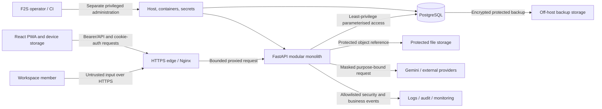

# F2S Security and Privacy Design

## 1. Purpose and status

This document defines the initial F2S threat model, security architecture, privacy boundaries, control baseline, and required verification. It is a Phase 0 design for future implementation and review.

It follows the [Product Requirements](02_Product_Requirements.md), [Functional Requirements](03_Functional_Requirements.md), [Non-Functional Requirements](04_Non_Functional_Requirements.md), [System Architecture](07_System_Architecture.md), [Database Design](08_Database_Design.md), [REST API Design](09_API_Design.md), [UI/UX Design](10_UI_UX_Design.md), and [Data Dictionary](21_Data_Dictionary.md).

This document creates no authentication code, middleware, infrastructure, hardening script, secret, schema, penetration test, or production permission. Values marked **Provisional** are initial safe planning limits that must be measured on the approved production-like environment before release.

## 2. External verification baseline

F2S uses versioned external security guidance as a verification aid, not as a substitute for project-specific threat analysis:

- [OWASP Application Security Verification Standard 5.0.0](https://owasp.org/www-project-application-security-verification-standard/) is the initial web-application control catalogue.
- [NIST SP 800-63B-4](https://pages.nist.gov/800-63-4/sp800-63b.html) informs password and session-secret design.
- [OWASP Session Management Cheat Sheet](https://cheatsheetseries.owasp.org/cheatsheets/Session_Management_Cheat_Sheet.html) informs browser-session handling.
- [OWASP File Upload Cheat Sheet](https://cheatsheetseries.owasp.org/cheatsheets/File_Upload_Cheat_Sheet.html) informs attachment controls.

References are pinned by version or review date in the implementation/test strategy. A newer external version does not silently change F2S behavior; an issue must review and adopt the change.

## 3. Security objectives and invariants

1. A user may access only the capabilities and records authorised for the selected workspace.
2. Cross-workspace identifiers never expose content, existence, counts, timing distinctions, files, jobs, reports, AI payloads, or cached data.
3. Financial and farming facts cannot be silently duplicated, overwritten, recalculated by an untrusted layer, or changed without required audit evidence.
4. Credentials, secrets, full payment details, and unmasked AI payloads never enter logs, repositories, images, CI output, URLs, analytics, or ordinary errors.
5. The browser, network, external providers, uploaded files, and all request data remain untrusted.
6. Optional/provider failure cannot corrupt an already committed independent core record.
7. Production fails closed when security-sensitive configuration is missing or unsafe.
8. Backups, exports, temporary files, offline copies, and logs receive protection proportional to the source data.
9. Security controls remain usable under Shan-first mobile and unstable-connectivity conditions.
10. Detection, correlation, revocation, recovery, and safe failure are part of the control, not operational afterthoughts.

## 4. Scope, assumptions, and non-goals

### 4.1 In scope

- identity, account activation, authentication, sessions, password change, logout, and deactivation;
- workspace ownership, membership, role/capability enforcement, and object isolation;
- browser/PWA, HTTPS edge, REST API, modular backend, PostgreSQL, file storage, and operational access;
- uploads, downloads, reports, exports, offline storage/queues, backups, logs, audit, AI, email, and future providers;
- configuration, secrets, dependencies, images, CI/CD, deployment, monitoring, and incident evidence; and
- abuse, replay, concurrency, availability, privacy, retention, and recovery.

### 4.2 Assumptions

- Production uses HTTPS and one controlled application origin.
- The database and backend are not public internet services.
- F2S initially has a small workspace user population but must not rely on obscurity or low traffic.
- Operators have separately controlled infrastructure access; operator access does not grant ordinary workspace business authority.
- Client devices may be shared, lost, compromised, offline, or running hostile extensions.
- Gemini, email, storage, package registries, and other providers can fail or be compromised.

### 4.3 Non-goals for this issue

- selecting a commercial identity provider, WAF, SIEM, malware scanner, or secrets product;
- implementing multi-factor authentication, passkeys, SSO, or application code for the documented recovery contract;
- legal conclusions about retention, residency, or regulatory classification;
- physical-datacentre security; and
- claiming penetration-test or production-hardening completion.

MFA/passkeys remain a required risk decision before broader public exposure. Concealed single-use account recovery is required before public launch by ADR-015.

## 5. Asset and data classification register

| Asset ID | Asset | Classification | Primary risk | Required protection |
| --- | --- | --- | --- | --- |
| A-01 | Password verifiers, activation/recovery evidence | Restricted | Account takeover | Salted expensive hashing or digest, one-time use, least privilege, no logs |
| A-02 | Access/refresh session secrets and CSRF secrets | Restricted | Session takeover/replay | High entropy, digest at rest, secure transport/storage, rotation/revocation |
| A-03 | Workspaces, owner references, memberships, roles, activation/recovery/transfer challenges, settings | Confidential/Restricted by field | Privilege escalation/isolation failure | Backend policy, versioning, digest-only credentials, audit, same-workspace constraints |
| A-04 | Finance, payments, references, debts, receivables | Confidential/Restricted by field | Disclosure or false financial history | Workspace scope, exact values, transactions, approval lifecycle, protected copies |
| A-05 | Farm plans, costs, harvests, sales, profitability | Confidential | Disclosure or manipulated decisions | Workspace scope, canonical calculations, audit/provenance |
| A-06 | Attachments and receipts | Restricted unless classified lower | Malware/path traversal/disclosure | Allowlist, quarantine, scan, generated key, authorised delivery |
| A-07 | Reports, exports, dashboards, forecasts | Confidential | Bulk disclosure/formula mismatch | Verified dataset, authorisation, short retention, protected download |
| A-08 | AI source, masked payload, response, metadata | Restricted before masking; Confidential after approval | External disclosure/injection | Purpose validation, deterministic masking, schema validation, minimal retention |
| A-09 | Audit events and security telemetry | Confidential | Tampering or secondary data store | Append-only intent, allowlisted fields, restricted query, integrity/retention |
| A-10 | Operational logs, traces, metrics | Internal/Confidential | Secret/workspace leakage | Structured allowlist, redaction, access control, short retention |
| A-11 | Database and file backups | Same maximum classification as source | Bulk breach/unrecoverable loss | Encryption, off-host protection, separate credentials, restore verification |
| A-12 | Source, images, dependencies, CI artifacts | Internal/Public by artifact | Supply-chain compromise/secret exposure | Review, pinning, scanning, provenance, no production secrets |
| A-13 | Deployment credentials, API keys, TLS/private keys | Restricted | Full-system/provider compromise | External secret storage, least privilege, rotation, access audit |
| A-14 | Offline drafts, queues, cached views | Same classification as contained fields | Lost/shared-device disclosure or replay | Minimise, bound, expire, clear, never store auth secrets |

Every new field or artifact records purpose, classification, authorised audience, log/export/AI rule, retention owner, and deletion behavior before implementation.

## 6. Actors and adversaries

| Actor | Trust posture | Security concern |
| --- | --- | --- |
| Admin / Workspace Owner | Authenticated but requests remain untrusted | Account compromise, ownership-transfer abuse, accidental high-impact action, misuse of broad capability |
| Contributor | Authenticated with limited submission capability | Restricted-total extraction, approval bypass, cross-module/cross-workspace access |
| Advisor | Authenticated read-only with comment/flag capability | Mutation or approval attempts, bulk extraction, stale permission |
| Anonymous user | Untrusted | Credential guessing, enumeration, activation/recovery abuse, scanning |
| Compromised user/browser | Hostile within a valid session | XSS, token theft, excessive export, CSRF, malicious input |
| External attacker | Hostile | Injection, credential stuffing, denial of service, exploit/supply-chain use |
| F2S operator | Privileged operational actor, not workspace actor | Mistake, misuse, stolen SSH/deployment/backup credential |
| CI/deployment system | Privileged machine actor | Artifact tampering, secret leakage, dependency compromise |
| Gemini/email/file provider | External and untrusted | Data leakage, prompt/output manipulation, outage, malicious response |
| Uploaded file | Untrusted content | Malware, parser exploit, active content, decompression, traversal |

## 7. Trust boundaries and data flow

| Boundary ID | Boundary | Untrusted crossing | Mandatory decision point |
| --- | --- | --- | --- |
| TB-01 | User/device to browser | Input, local files, extensions, shared device | UI safety only; no authority decision |
| TB-02 | Internet to HTTPS edge | Methods, headers, body, connection rate | TLS, size/time limits, header normalization, coarse abuse control |
| TB-03 | Edge to backend | Forwarded identity/network metadata | Trusted-proxy allowlist; backend authn/authz/validation |
| TB-04 | Backend to database | Queries, transactions, migrations | Least-privilege role, parameterisation, workspace scope, constraints |
| TB-05 | Backend to file storage/parser | File bytes, names, metadata | Quarantine, allowlist, scan, generated key, expiry |
| TB-06 | Backend to provider | Masked dataset and external response | Purpose/permission, minimisation, timeout, schema/safety validation |
| TB-07 | Runtime to logs/audit/monitoring | Potentially sensitive event context | Allowlisted schema, redaction, access/retention controls |
| TB-08 | Live data to backup/restore | Complete protected datasets and keys | Encryption, independent credentials, integrity, restored isolation checks |
| TB-09 | Operator/CI to runtime | Code, image, migration, configuration, secret | Strong admin auth, review, provenance, separation, audit |

No `X-Forwarded-*` value, browser role, hidden control, request workspace header, file metadata, provider assertion, or log field is trusted without the decision defined at its owning boundary.

## 8. Threat-model method

The initial model combines STRIDE categories (spoofing, tampering, repudiation, information disclosure, denial of service, elevation of privilege) with explicit privacy, financial-integrity, offline, and provider threats.

Risk priority considers impact on workspace confidentiality, financial correctness, authority, recoverability, and exploitability. `Critical` and `High` threats require prevention and detection evidence before the affected feature is released. Accepted residual risk requires an owner, rationale, compensating control, expiry, and review date.

## 9. Threat-to-control traceability matrix

| Threat ID | Scenario | Risk | Prevent/detect controls | Required verification |
| --- | --- | --- | --- | --- |
| T-01 | Password guessing, credential stuffing, or account enumeration | High | C-01, C-02, C-15 | Uniform responses/timing review, blocklist, per-account/IP throttling, alert fixtures |
| T-02 | Stolen, replayed, fixed, or reused session secret | Critical | C-02, C-03, C-04 | Rotation/reuse/concurrent/lost-response/logout/deactivation tests |
| T-03 | Cross-site request forgery on cookie-authenticated actions | High | C-03, C-05 | Missing/wrong/stale CSRF token and hostile Origin tests |
| T-04 | XSS or malicious dependency steals data/acts as user | Critical | C-05, C-06, C-17 | Encoding/injection fixtures, CSP enforcement, dependency and browser tests |
| T-05 | Overbroad CORS or proxy-header trust bypasses origin/client policy | High | C-05, C-16 | Unapproved/null/wildcard origin, credential, preflight, spoofed-forwarded-header tests |
| T-06 | SQL/command/template/header injection or mass assignment | Critical | C-06, C-09, C-10 | Injection corpus, unknown-field rejection, parameterised repository tests |
| T-07 | IDOR/BOLA exposes or changes another workspace | Critical | C-07, C-08 | Complete two-workspace isolation matrix and no-side-effect assertions |
| T-08 | Ownership, role, membership, or challenge manipulation elevates privilege | Critical | C-07, C-08, C-14 | Bootstrap race, role transition, sole-owner, transfer concurrency, challenge replay, stale session, and audit tests |
| T-09 | Retry, concurrency, cursor, or idempotency abuse duplicates/overwrites finance | Critical | C-08, C-09, C-14 | Concurrent, stale ETag, replay, timeout-after-commit, fingerprint tests |
| T-10 | Malicious upload executes, traverses, exhausts, or exposes content | High | C-10, C-11, C-15 | Type/signature/size/name/traversal/malware/quarantine/decompression tests |
| T-11 | Report/export/download leaks bulk or expired/foreign data | High | C-07, C-11, C-13 | Filter/auth/expiry/cache/filename/formula/cross-workspace download tests |
| T-12 | Lost/shared offline device reveals or replays protected data | High | C-03, C-12, C-13 | Logout/switch/expiry/quota/replay/conflict/lost-device scenarios |
| T-13 | Logs, audit, traces, analytics, or errors leak secrets/data | High | C-13, C-14 | Prohibited-value canaries, schema/redaction/error/correlation tests |
| T-14 | AI receives prohibited data or returns injected/unsafe output | High | C-07, C-13, C-18 | Deterministic masking, free-text attacks, schema, timeout, fallback fixtures |
| T-15 | Secret, dependency, image, CI, or artifact compromise | Critical | C-16, C-17 | Secret/SCA/image/SBOM/provenance scans and clean-environment release test |
| T-16 | Weak TLS, public database, unsafe host/container configuration | Critical | C-05, C-16, C-19 | External network/TLS/configuration/negative-startup scans |
| T-17 | Backup theft, tampering, key loss, or untested restore | Critical | C-13, C-19, C-20 | Access/encryption/integrity/expiry/quarterly restore evidence |
| T-18 | Expensive auth/upload/export/report/AI requests exhaust capacity | High | C-04, C-10, C-15, C-18 | Threshold, concurrency, body-size, timeout, recovery, distributed-limit tests |
| T-19 | Provider/URL/parser behavior enables SSRF or internal access | High | C-10, C-18, C-19 | URL allowlist/DNS redirect/metadata-address/parser sandbox tests where applicable |
| T-20 | Privileged operator misuse or credential compromise | Critical | C-14, C-16, C-19 | Admin access review, key rotation, least privilege, audit and incident drill |
| T-21 | Excess retention or real data in non-production increases exposure | High | C-13, C-20 | Retention expiry, fixture scan, environment inventory, deletion evidence |
| T-22 | Error, timing, count, cache, or metadata reveals protected existence | High | C-05, C-07, C-13 | Concealed-not-found equivalence, cache isolation, aggregate/list/error tests |

## 10. Control register

| Control ID | Control family | Core responsibility |
| --- | --- | --- |
| C-01 | Password and activation policy | Strong usable secrets, safe verifier storage, one-time activation/recovery |
| C-02 | Authentication defense | Uniform responses, throttling, detection, reauthentication |
| C-03 | Session and browser credential safety | Opaque secrets, secure cookie, memory-only access token, rotation/revocation |
| C-04 | Replay and session lifecycle | Absolute/idle expiry, reuse detection, step-up, current authority check |
| C-05 | Browser, edge, and origin policy | HTTPS, CSP/headers, CSRF, CORS, proxy trust, no-store |
| C-06 | Input/output safety | Strict schemas, parameterisation, contextual encoding, safe errors |
| C-07 | Authorisation and isolation | Request-scoped context, capability checks, same-workspace references, Contributor response minimisation |
| C-08 | Data/financial integrity | Transactions, composite constraints, versioning, idempotency, canonical links |
| C-09 | API abuse resistance | Method/media/size/filter/sort/cursor/precondition controls |
| C-10 | File/parser safety | Allowlist, signature, generated storage key, quarantine, scan, limits |
| C-11 | Protected artifact delivery | Authorised generation/download, safe filename, short expiry, deletion |
| C-12 | Offline minimisation | Bounded scope/age/queue, no credentials, clear/conflict behavior |
| C-13 | Privacy and retention | Classification, minimisation, channel rules, protected copies, expiry |
| C-14 | Audit and detection | Required structured events, correlation, integrity, access, alerts |
| C-15 | Rate/capacity control | Risk-tier limits, quotas, concurrency, timeout, bounded retry |
| C-16 | Secret/config/admin control | External secrets, fail-closed schema, least privilege, rotation |
| C-17 | Supply-chain assurance | Pinning, review, scans, SBOM, provenance, release gates |
| C-19 | Runtime/network hardening | Minimal exposure, non-root, patching, protected database/storage |
| C-20 | Backup/recovery/data lifecycle | Encryption, independent copy/access, integrity, restore, deletion |

## 11. Identity, passwords, and account lifecycle

### 11.1 Password policy

- Single-factor passwords have a minimum of 15 Unicode characters and permit at least 64 characters.
- Arbitrary composition rules and periodic forced changes are prohibited; compromise evidence requires change/revocation.
- Common, expected, context-specific, and known-compromised passwords are blocklisted with a helpful non-enumerating response.
- Paste, password managers, autofill, and an accessible reveal control are allowed.
- Passwords are never trimmed, logged, included in URLs, emailed, or retained after verifier construction.
- Argon2id is required. The initial benchmark candidate is 64 MiB memory, 3 iterations, parallelism 1, unique random salt, and versioned parameters (**Provisional**). Production chooses the strongest tested parameters that meet the authentication capacity/p95 budget; old verifiers are upgraded after successful login.

### 11.2 Activation, password change, and recovery

- Activation/recovery evidence is opaque, high entropy, stored only as a digest, single purpose, single use, and expires after 24 hours (**Provisional**).
- Responses do not reveal whether an unrelated email/account exists.
- Password change requires current-password or approved step-up proof, rotates the account security version, and revokes other sessions by default.
- Deactivation prevents new authentication and invalidates active sessions at the next protected check.
- Recovery cannot rely on knowledge-based security questions. The exact recovery and MFA/passkey design requires a separate approved issue before public use.
- Owner recovery and sole-owner changes require a separately reviewed high-assurance workflow; support/operator access cannot silently assume workspace ownership or create a second owner.

## 12. Session and token design

### 12.1 Credential format and storage

- Access and refresh credentials are independent opaque, cryptographically random bearer secrets; clear tokens are returned only to the intended client and only digests are stored server-side.
- The access credential is sent as `Authorization: Bearer` and kept in browser memory only.
- Access, refresh, session, activation, and CSRF secrets are never stored in `localStorage`, `sessionStorage`, URLs, logs, analytics, or service-worker caches.
- Refresh is carried in a `__Host-f2s_refresh` cookie with `Secure`, `HttpOnly`, `SameSite=Strict`, `Path=/`, no `Domain`, and an expiry not beyond server-side session validity.
- Cookie contents are opaque and contain no user, workspace, role, or personal data.

### 12.2 Initial lifecycle values

| Setting | Initial value | Status |
| --- | --- | --- |
| Access-token lifetime | 15 minutes | Provisional |
| Refresh idle expiry | 7 days since last successful rotation | Provisional |
| Absolute session lifetime | 30 days from authentication | Provisional |
| Rotation grace | 0 seconds; single-use refresh | Provisional; reassess lost-response usability |
| Step-up freshness for high-impact identity/access action | 10 minutes | Provisional |
| Revocation/deactivation check | Every protected request through current server session/account state | Required |

Every refresh rotates the secret atomically. Reuse of an invalidated refresh token revokes the token family and creates a security event. Clients perform single-flight refresh; network-loss behavior fails safely to reauthentication rather than minting parallel families.

Logout revokes the current family and expires the cookie. Password compromise, password change, account deactivation, role/ownership security event, or operator incident action can revoke all relevant sessions. Protected output is never replayed without current account, membership, and capability checks.

## 13. CSRF, CORS, CSP, and browser headers

### 13.1 CSRF

Cookie-authenticated refresh, logout, and any future cookie-authenticated mutation require:

- exact approved `Origin` validation with safe `Referer` fallback where appropriate;
- a session-bound synchronizer CSRF token delivered outside the HttpOnly cookie and sent in a custom header;
- a same-origin, non-mutating, `no-store` bootstrap mechanism may return that token after page reload; it binds to the eligible refresh session, remains in memory only, and grants no authority by itself;
- non-simple JSON/custom-header requests with strict media types; and
- no state change through `GET`, navigation, image, or form-compatible endpoints.

SameSite is defense in depth, not the only CSRF control. Login and activation also validate the approved origin to prevent session confusion.

### 13.2 CORS

- Production defaults to same-origin requests.
- If a separate frontend origin is approved, CORS lists exact HTTPS origins; wildcard, reflected, regex-suffix, and `null` origins are rejected.
- Credentialed requests never use `Access-Control-Allow-Origin: *`.
- Allowed methods/headers are minimal; preflight results are bounded and vary by Origin.
- CORS is not authorisation and never exposes protected errors before authentication/workspace checks.

### 13.3 CSP and security headers

The initial production CSP intent is deny-by-default: `default-src 'none'`; scripts, styles, fonts, images, connections, workers, forms, and manifests explicitly allow only required same-origin sources; `object-src 'none'`; `base-uri 'none'`; `frame-ancestors 'none'`; and `form-action 'self'`. Inline script/eval is prohibited; an unavoidable inline asset requires a reviewed nonce/hash approach. Provider network access occurs from the backend, not browser CSP exceptions.

The edge also sets and tests:

- HSTS with an initial one-year `max-age` after HTTPS/domain validation; include-subdomains/preload require operational confirmation;
- `X-Content-Type-Options: nosniff`;
- `Referrer-Policy: no-referrer` for protected application pages;
- a least-privilege `Permissions-Policy` disabling unused sensors/capabilities;
- anti-framing through CSP;
- protected JSON/files with `Cache-Control: no-store` unless a reviewed private-cache contract exists; and
- generic server identity without framework/version banners.

Report-only CSP may collect a short pre-enforcement validation sample, but production release requires enforced policy and reports must exclude sensitive URLs/content.

## 14. Authentication and abuse limits

Limits use distributed server-side counters and combine account/session/actor/workspace/IP/device signals without treating IP as identity. All values are **Provisional** and require capacity and false-positive testing.

| Operation | Initial limit/action |
| --- | --- |
| Login | After 5 failed attempts/account/15 minutes, increasing delay; 30 attempts/IP/15 minutes; no revealing hard lock |
| Activation/recovery request or proof | 5/account-or-recipient/hour and 20/IP/hour |
| Refresh | 30/session/5 minutes; invalid/reused token follows security handling |
| Protected reads | 120/actor/minute and 300/workspace/minute |
| Protected writes | 30/actor/minute and 60/workspace/minute; idempotency still required |
| Upload | 20 files/actor/hour plus purpose-specific byte/storage quota |
| Report/export | 5/actor/10 minutes, 10/workspace/10 minutes, maximum 2 concurrent |
| AI advice | 5/actor/10 minutes, 20/workspace/hour, maximum 1 concurrent/actor |

Responses use safe `429 RATE_LIMITED` and `Retry-After` when known. Limits apply before expensive hashing, parsing, rendering, or provider calls where feasible. Successful idempotent replay may use a low-cost tier but never bypasses abuse detection or authorisation.

## 15. Authorisation and workspace isolation

The backend enforces this sequence for every protected operation:

1. validate the current authenticated server-side session;
2. load an Active membership for the workspace in the path;
3. evaluate the required current capability for `ADMIN`, `CONTRIBUTOR`, or `ADVISOR`;
4. validate every path, body, query, cursor, include, parent, file, job, and idempotency reference against the same workspace;
5. execute an owning-module query scoped by `workspace_id`;
6. apply version/state/business constraints; and
7. append required safe audit evidence in the owning transaction.

Frontend roles, client claims, cached permission, UUID unpredictability, hidden controls, `X-Workspace-ID`, and post-query filtering are never authority. Contributor queries and response schemas omit restricted totals; official datasets select only Approved records.

PostgreSQL row-level security remains a later ADR/design decision and, if adopted, is defense in depth. It cannot replace application capability checks, owning-repository workspace predicates, or same-workspace relational constraints.

### 15.1 Concealment behavior

- Missing authentication returns `401` with a safe stable code.
- A known capability denial inside the actor's workspace may return `403`.
- Missing, foreign-workspace, or intentionally concealed resource identifiers return the same `404 RESOURCE_NOT_FOUND` shape.
- Responses, timing, pagination, counts, suggestions, caches, logs, and correlation lookup must not reveal the foreign resource.

### 15.2 Mandatory isolation test matrix

Every protected resource family is tested with at least two workspaces, users with different roles, a multi-workspace user, an inactive membership, and synthetic identifiers across:

- list, item view, create, patch, lifecycle command, reversal, archive, restore, and delete where permitted;
- foreign IDs in path, body, nested object, parent, filter, sort, search, cursor, include, and batch input;
- count, total, dashboard, comparison, calculation, data-quality, and other aggregates;
- report/export request, generated file, download, filename, and expired reference;
- upload parent, file status, preview, and attachment download;
- audit query, correlation search, background job, notification, and asynchronous status;
- AI purpose, source dataset, masking input, request status, and result;
- idempotency-key scope, request fingerprint, ETag/version, replay, and offline queue; and
- cache key, service-worker data, workspace switch, logout, deactivation, and restored backup.

Each negative case asserts safe status/body, no protected field/count/timing distinction, no mutation, no audit leakage, no file/provider call, and no cache contamination. Each positive control proves the intended authorised operation still works.

## 16. Validation, injection, and output safety

- Request methods, content types, body sizes, field names, types, lengths, ranges, decimal scales, codes, state transitions, and relationships use strict allowlisted schemas.
- Unknown command fields are rejected; clients cannot bind role, workspace, approval, calculated, audit, ownership, or internal fields through mass assignment.
- Database access is parameterised through owning repositories; dynamic identifiers/order/filter fields use explicit allowlists.
- Shell commands and dynamic template/code evaluation are prohibited in request processing unless a separately reviewed adapter has no safer option.
- User/provider text is contextually encoded at the final HTML/attribute/URL/CSV/PDF/Excel sink; sanitisation is purpose-specific and never the only XSS control.
- Outbound URLs/providers use an allowlist; redirects, DNS changes, private/link-local/metadata addresses, schemes, ports, and response sizes are constrained to prevent SSRF.
- Error responses follow the stable API envelope and contain no stack, SQL, filesystem path, parser detail, secret, raw provider body, or protected existence.
- Proxy/application duplicate or conflicting security headers are rejected or normalized according to one documented owner.

## 17. File upload and protected download

### 17.1 Initial upload policy

The initial receipt/attachment policy allows PDF, JPEG, and PNG only, with a maximum of 10 MiB per file (**Provisional**). SVG, HTML, archives, executables, scripts, macro-capable office files, and unknown types are rejected. Purpose-specific features may narrow this list and size but cannot widen it without security review.

Uploads require current workspace/purpose/parent authorisation before bytes are accepted and then:

1. stream through edge/application size and time limits;
2. ignore the client path and treat the original name as untrusted display metadata;
3. compare extension, declared type, content signature, and parser result;
4. assign a random server storage key outside the served application tree;
5. store as quarantined and unavailable;
6. run approved malware and active-content processing in a constrained worker;
7. make the file available only after successful validation/scan; and
8. record safe checksum, size, type, purpose, owner, status, expiry, and audit metadata.

Image re-encoding and PDF active-content sanitisation are required if those formats are rendered inline. A scan timeout/failure remains quarantined; it is never treated as clean.

### 17.2 Delivery

- Downloads recheck current session, membership, capability, workspace, parent, purpose, clean status, and expiry.
- References are unguessable and expire after 5 minutes (**Provisional**) or stream through an authorised endpoint.
- Responses use a sanitised filename, `nosniff`, attachment disposition unless reviewed safe inline rendering applies, and `no-store`.
- File bytes are not served by a public bucket/path or permanent unauthorised URL.
- Range requests, thumbnails, previews, and content transformation require the same authorisation and isolation tests.

## 18. Reports and exports

- The authorised filtered verified dataset is materialised only after current workspace, capability, role-specific field, and Approved-record checks.
- Report and export jobs store the requesting actor, workspace, filters, dataset/formula version, purpose, status, expiry, and safe correlation metadata.
- CSV/Excel cells beginning with formula/control prefixes are escaped according to the report design; user text cannot become executable spreadsheet content.
- Filenames are server generated/sanitised and contain no secret or unnecessary personal data.
- Completed artifact bytes expire after 24 hours (**Provisional**); a download reference expires after 5 minutes and does not extend artifact retention.
- Job status and download remain authorised after creation; lost permission prevents access.
- Failed/partial artifacts are unavailable and deleted safely.
- Dashboard, PDF, Excel, CSV, and AI preparation use the same verified dataset/calculation owner; export cannot broaden filters or fields.

## 19. Offline and PWA security

### 19.1 Storage limits

- The application shell contains no workspace data or credentials.
- Access/refresh/session/CSRF secrets are excluded from service-worker caches, Cache API, IndexedDB, local/session storage, queued bodies, crash reports, and URLs.
- Restricted fields (password/authentication data, full payment/bank details, unmasked AI source, attachments, reports) are not approved for offline persistence.
- Approved confidential drafts/queue records expire after 7 days, are limited to 100 items and 5 MiB total per device/profile, and stop accepting writes safely at either limit (**Provisional**).
- Approved recent read-only cache expires after 24 hours and is limited to 20 MiB; every view displays last-verified time and workspace context (**Provisional**).
- Offline attachments and bulk exports are not supported initially.

Browser storage encryption is not described as protection against XSS or a user controlling the active browser profile. Device-level protection, minimal fields, bounded lifetime, and server reauthorisation remain necessary.

### 19.2 Queue and clearing

- Each queued operation records an opaque local ID, workspace, operation type, retry identifier, creation and expiry timestamps, version/precondition, and minimal validated payload.
- Synchronisation reauthenticates and reauthorises every item and never silently merges financial conflicts.
- Logout, workspace membership removal/deactivation, explicit clear-data action, and account deactivation clear protected local state when the app can execute; an offline device cannot be assumed remotely erased.
- Workspace switching never displays the prior workspace cache in the new context.
- Failed, conflicted, expired, or lost-authority items remain visibly distinct and do not retry indefinitely.

## 20. AI and external provider security

AI processing is backend-only and follows:

1. authenticate, authorise workspace/capability/purpose, and apply abuse limits;
2. obtain a versioned verified dataset from its owner;
3. reject unsupported, insufficient, stale, or unsafe purposes before provider contact;
4. deterministically remove/replace names, contacts, addresses, payment/bank details, references, authentication data, secrets, and unnecessary free text;
5. validate the outbound allowlisted schema and prohibited-field canaries;
6. send only to the configured allowlisted provider/model with finite timeout and bounded retry;
7. treat instructions inside workspace/provider content as data, not system authority;
8. validate response structure, numeric references, fact/forecast distinction, uncertainty, safety, and language contract; and
9. return safe fallback without mutating source data when any step fails.

Raw unmasked prompts, full provider payloads, credentials, and sensitive responses are not logged. Audit stores actor, workspace, purpose, dataset/model/policy versions, timestamps, result code, and correlation only. Provider terms, retention, region, training use, subprocessors, and deletion behavior require approval before production.

## 21. Logging, audit, monitoring, and errors

### 21.1 Structured logging

Logs use an allowlisted schema such as timestamp, level, service/module, event code, safe route template, status class, duration, correlation ID, deployment version, and pseudonymous/internal actor or workspace reference only where operationally necessary.

Logs never contain passwords, tokens, cookies, authorisation/CSRF headers, API keys, private keys, activation/recovery evidence, full payment/bank details, raw attachments/reports, request/response bodies by default, unmasked AI payloads, or unsafe user free text.

Redaction happens before serialization/export. Security tests inject synthetic canary values into every prohibited channel and prove absence from application, edge, database, provider, tracing, CI, and error outputs.

### 21.2 Audit

- Policy-required authentication, membership/role, finance/farming, reversal, export, file, forecast, AI, setting, and security actions create structured audit intent.
- Audit includes actor, workspace, action, resource type/safe ID, result, server time, correlation, module, and minimal safe metadata.
- Audit is append-only through its service contract; correction adds an event.
- Audit query is separately capability-controlled, workspace scoped, paginated, filtered by allowlist, and itself auditable where required.
- Audit does not duplicate full records, secrets, or raw before/after payment/AI payloads.

### 21.3 Detection and alerts

Operator-visible alerts cover repeated authentication failure, refresh reuse, privilege/owner change, secret/config failure, cross-workspace denial anomaly, malware/upload spike, export/AI abuse, unexpected 5xx rate, database/storage health, backup failure/age, disk/certificate expiry, and security-scan release failure.

Alerts contain enough correlation to investigate without copying protected payloads. Alert access and delivery channels are restricted and tested.

## 22. Secrets, configuration, CI, and supply chain

- Production secrets remain outside source, images, compose files, frontend bundles, test fixtures, logs, support bundles, and generated artifacts.
- Each secret has owner, purpose, consumer, environment, least privilege, creation/rotation/revocation procedure, and incident action.
- Development/test/production credentials and provider projects are separate; production data is prohibited outside production without an approved protected-data procedure.
- Configuration uses a typed allowlist and fails startup in production for missing/placeholder secrets, wildcard origins, insecure cookies, debug/docs exposure, unsafe host/proxy trust, public database binding, or disabled security controls.
- CI receives minimum short-lived permissions where supported; pull-request code from untrusted contexts cannot access production secrets or deployment credentials.
- Dependencies and base images are pinned through lockfiles/immutable identifiers, reviewed, scanned, and updated through auditable pull requests.
- Releases produce an SBOM and provenance/build record, run secret/SCA/container/configuration tests, and ship with zero unresolved known Critical/High findings unless an approved time-bound risk acceptance exists.
- Build and runtime images are minimal; compiler/package-manager/debug tools are absent from production where unnecessary.

## 23. Deployment, network, and database protection

- Public exposure is limited to HTTPS; port 80 may redirect to HTTPS. PostgreSQL, backend application ports, metrics, admin tools, and file storage are not public.
- TLS 1.2 is the minimum initial protocol and TLS 1.3 is preferred; deprecated protocols/ciphers are disabled and externally scanned.
- Trusted proxy count/addresses are explicit; direct backend access cannot spoof client IP, scheme, host, or forwarded identity.
- Host firewall denies by default. Administrative access uses named accounts, key-based strong authentication, least privilege, restricted source where practical, no routine root login, and reviewed key rotation.
- Application/container processes run as non-root, drop unnecessary capabilities, use read-only filesystems where practical, and receive only their required secret/storage/network access.
- PostgreSQL uses a dedicated least-privilege application role; migration/backup/operator roles are separate. Application runtime cannot create roles/databases or bypass ownership policy.
- Database connections use protected local/private transport and authentication; public listen/firewall exposure is prohibited.
- Security patches, image refresh, time synchronisation, disk capacity, certificate renewal, and restart behavior have monitored operational procedures.

## 24. Backup, recovery, retention, and deletion

- Backups are encrypted before or at protected storage, authenticated/integrity checked, and copied off-host using credentials independent from ordinary application runtime.
- Encryption keys are separated from backup bytes, access reviewed, recoverable by an approved custodian, rotated with a documented old-backup strategy, and never stored only on the protected host.
- Backup jobs use read-only/minimal privilege, do not log record content, and alert on failure or excess age.
- Restore occurs into an isolated environment with restricted access and no external provider/email side effects.
- Restore verification includes schema/version, row/count reconciliation, financial invariants, file references, session invalidation policy, and the complete two-workspace isolation suite.
- Recovery-point objective begins at no more than 24 hours; complete restore must meet the approved recovery-time objective established by the backup design.
- A successful restore is tested before first production release, at least quarterly, and after material format/topology/key changes.

### 24.1 Initial retention planning values

| Artifact | Initial retention | Status |
| --- | --- | --- |
| Edge access logs | 14 days | Provisional |
| Application/security logs | 30 days | Provisional |
| Audit events | 365 days minimum, then legal/business review | Provisional |
| Generated report/export bytes | 24 hours | Provisional |
| Quarantined/failed upload bytes | 24 hours after final failure | Provisional |
| Successful upload bytes | Purpose/record lifecycle; requires field-level retention approval | TBD-VALIDATE |
| Raw AI request/response payload | Not retained by F2S | Required |
| Safe AI request metadata | 90 days | Provisional |
| Offline drafts/queue | 7 days maximum | Provisional |
| Backups | 7 daily, 5 weekly, and 12 monthly full recovery points; dependent WAL and two independent encrypted backup copies follow the Backup and Recovery Design | Provisional |

Deletion jobs are authorised, bounded, idempotent, audited safely, and tested against foreign/current records. Backup expiry follows the independent backup policy; deletion from live data does not falsely promise immediate removal from every protected backup.

## 25. Verification and release gates

| Gate | Evidence required before affected production release |
| --- | --- |
| Threat traceability | Every in-scope threat maps to prevention/detection, owner, tests, and accepted residual risk |
| Identity/session | Password/hash benchmark, enumeration, throttle, expiry, rotation, reuse, revocation, logout, deactivation |
| Workspace isolation | Full Section 15.2 matrix with positive/negative cases and no-side-effect assertions |
| Browser/API | TLS, headers, CSP, CORS, CSRF, cache, proxy trust, strict schema, safe error tests |
| Injection | SQL, XSS, mass assignment, path, header, CSV/formula, template/command/SSRF fixtures as applicable |
| Files/reports | Type/signature/size/malware/quarantine/name/path/expiry/auth/cache/failed-partial tests |
| Offline | Credential absence, scope/age/quota, logout/switch, reconnect/replay/conflict/lost-authority tests |
| AI/provider | Purpose/auth, masking canaries, injection/schema/numeric/safety/timeout/retry/fallback, log absence |
| Privacy/logging | Field/channel inventory, prohibited canaries, retention/expiry, non-production data scan |
| Supply chain | Secret, dependency, image, SBOM, provenance, configuration, Critical/High finding gate |
| Runtime | External port/TLS scan, non-root/privilege, database exposure, secret/config negative startup |
| Backup/recovery | Encryption/access/integrity/age evidence and timed isolated restore with reconciliation/isolation |
| Accessibility/security UX | Shan-first safe messages, session/confirmation/recovery states, keyboard/screen-reader/mobile checks |

Security testing uses synthetic fixtures only. Automated scanners supplement, not replace, targeted service/repository/API/browser/configuration reviews. Penetration testing is scheduled before production exposure but remains out of scope for this documentation issue.

## 26. Security review and change governance

A security review is required for changes to identity/session, roles, workspace ownership, public routes, CORS/CSP/cookies, file types/parsers, exports, offline fields, provider/AI data, logging schemas, retention, secrets, dependencies with material privilege, network exposure, backups, or operator access.

Pull requests identify affected threats/control IDs and verification evidence. A control cannot be removed or weakened solely for convenience; the change requires updated threat analysis and explicit risk decision. Security incidents feed corrective issues, regression tests, rotation/revocation actions, and this design without placing sensitive incident details in the public repository.

## 27. Deferred decisions and Issue #11 acceptance

Deferred: approved MFA/passkey/recovery design, exact production Argon2id parameters after benchmark, final rate limits after load/abuse tests, CSP hashes/nonces for the selected frontend build, malware/sanitisation tooling, offline encryption/device support, provider contracts, legal retention, backup matrix, SIEM/alert vendor, host topology, and penetration-test provider/scope.

Issue #11 is satisfied when review confirms that:

- assets, actors, trust boundaries, threats, controls, and verification are traceable;
- identity, isolation, API, database, uploads, exports, offline storage, backups, logs, AI, supply chain, and deployment are covered;
- token, cookie, CSRF, CORS, CSP, validation, secret, and abuse policies are explicit;
- every workspace-isolation surface has required two-workspace negative tests;
- passwords, tokens, authorisation headers, API keys, full payment details, and unmasked AI payloads are excluded from logs and ordinary errors;
- provisional values have owners and future validation gates;
- no real workspace data or production secret appears; and
- no authentication code, hardening implementation, schema, or penetration test is added.
