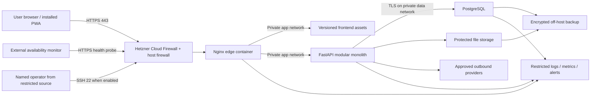

# F2S Local and Production Deployment Design

## 1. Purpose and status

This document defines the future F2S deployment contract: reproducible local services, the initial production topology on Hetzner Cloud, Docker and Compose boundaries, Nginx and TLS, PostgreSQL isolation, persistent storage, secrets, configuration, health, logs, monitoring, deployment, rollback, recovery dependencies, and failure handling.

It follows the [Non-Functional Requirements](04_Non_Functional_Requirements.md), [System Architecture](07_System_Architecture.md), [Database Design](08_Database_Design.md), [REST API Design](09_API_Design.md), [Security Design](15_Security_Design.md), [Test Strategy](17_Test_Strategy.md), and [ADR-002](adr/ADR-002-use-postgresql.md).

This document creates no Dockerfile, Compose file, Nginx configuration, cloud resource, DNS record, certificate, secret, database, volume, backup job, monitoring account, CI workflow, or application code. ADR-005 must approve Hetzner Cloud before production provisioning, and the backup/recovery design must approve recoverability before release.

## 2. Deployment principles

1. Local, CI, production-like and production use the same versioned service boundaries and approved PostgreSQL major version.
2. Environment-specific values and secrets remain external; source and immutable images do not change between deployments.
3. Only the HTTPS edge is public. Backend, PostgreSQL, storage, metrics and administration are not public application endpoints.
4. Production PostgreSQL has no public IP exposure and no host-published port.
5. Containers run with least privilege, immutable images, bounded resources and only the networks, storage and secrets they require.
6. A successful container start is not a successful deployment; readiness, migration, external smoke and monitoring evidence are required.
7. Database migrations are a separately authorised one-shot action, never an ordinary application-start side effect.
8. Persistent data is independent from container lifecycle. Recreating a container must not erase database or protected files.
9. Host/server snapshots do not replace application-consistent, encrypted, off-host backups and verified restore drills.
10. Deployment failure cannot silently corrupt financial history or be reported as healthy.
11. Logs, metrics, health responses, support output and CI artifacts contain no secrets or household payloads.
12. The initial single-server topology is a cost-conscious baseline, not a high-availability claim.

## 3. External documentation baseline

Provider and software behavior is checked again at implementation time. Initial official references are:

- [Docker: use Compose in production](https://docs.docker.com/compose/how-tos/production/)
- [Docker Compose service health and secret declarations](https://docs.docker.com/reference/compose-file/services/)
- [Docker Compose secret handling](https://docs.docker.com/compose/how-tos/use-secrets/)
- [Hetzner Cloud Networks](https://docs.hetzner.com/networking/networks/overview/)
- [Hetzner Cloud Firewall behavior](https://docs.hetzner.com/cloud/firewalls/faq/)
- [Hetzner server backups and snapshots](https://docs.hetzner.com/cloud/servers/backups-snapshots/faq/)
- [Hetzner Cloud Volumes](https://docs.hetzner.com/cloud/volumes/overview/)
- [Nginx HTTPS configuration](https://nginx.org/en/docs/http/configuring_https_servers.html)
- [Nginx proxy module](https://nginx.org/en/docs/http/ngx_http_proxy_module.html)
- [PostgreSQL connections and authentication](https://www.postgresql.org/docs/current/runtime-config-connection.html)
- [PostgreSQL host-based authentication](https://www.postgresql.org/docs/current/auth-pg-hba-conf.html)
- [PostgreSQL TLS](https://www.postgresql.org/docs/current/ssl-tcp.html)

These links inform validation but do not override F2S requirements, accepted ADRs, measured evidence, or later provider terms.

## 4. Environments and separation

| Environment | Data | Primary purpose | External access | Persistence |
| --- | --- | --- | --- | --- |
| Local development | Synthetic fixtures only | Developer build, tests and manual work | Loopback only by default; fake providers | Disposable unless an explicit named local volume is retained |
| CI | Deterministic synthetic fixtures | Automated build, test, scan and artifact evidence | Denied except approved dependency registries/services | Ephemeral; safe evidence retained by CI policy |
| Production-like | Synthetic reference dataset | Capacity, migration, security and deployment rehearsal | Restricted test operators and approved monitors | Recreated from code/fixtures; no production copy |
| Isolated restore | Protected restored data | Timed recovery and reconciliation | Restricted operators; email/providers/AI disabled | Destroyed safely after evidence and retention requirements |
| Production | Real household data | Live F2S service | Public HTTPS; restricted operator path | Protected database/files plus off-host backups |

Production uses separate Hetzner project/resources, domain, credentials, provider projects, storage, monitoring, encryption material and secret values. Development or CI credentials cannot access production. Production data is not copied into lower environments; restore drills containing production data remain controlled production operations.

Staging is not mandatory for the initial small-team baseline. If added, it follows production topology with separate resources and synthetic data; it is never a convenient production-data mirror.

## 5. Initial production topology

The initial production target is one supported Linux server in an approved Hetzner Cloud location. It runs Docker Engine and the approved Compose plugin. The application remains the modular monolith from ADR-001 with one PostgreSQL cluster from ADR-002.

### 5.1 Failure-domain statement

Nginx, backend, PostgreSQL and initial protected file storage share one server failure domain. A host, kernel, Docker daemon, filesystem, datacentre-network or account failure can make the whole service unavailable. Compose restart policies reduce process outage but do not create high availability.

The initial `99.5%` monthly availability target is provisional and must be measured. It does not promise zero downtime, automatic multi-region failover, or uninterrupted database upgrades. If observed availability, recovery time, capacity or risk becomes unacceptable, a later ADR must split the database/application or introduce replicated services.

## 6. Service and container inventory

| Service | Responsibility | Public? | Persistent write | Required dependencies |
| --- | --- | --- | --- | --- |
| `edge` | TLS termination, HTTP redirect, static delivery/proxy, headers, safe limits | Ports 80/443 only | Certificate/account material and bounded temporary files | Healthy frontend/API routes as configured |
| `frontend` | Versioned static PWA assets or dedicated static-serving stage | No direct host port | None at runtime | None |
| `api` | FastAPI modular monolith and authorised background coordination | No host port | Protected file interface only; source records through PostgreSQL | PostgreSQL; optional providers do not define core readiness |
| `worker` | Approved asynchronous reports/provider jobs if implementation separates it | No host port | Through owned database/file contracts | PostgreSQL and protected storage |
| `postgres` | One F2S PostgreSQL cluster/database | Never | Database volume, WAL/runtime data | Protected filesystem and backup mechanism |
| `migrate` | One-shot reviewed Alembic migration using migration principal | Never; no long-running process | Database schema only | Healthy PostgreSQL and approved release artifact |
| `backup` | Scheduled protected database/file backup and integrity evidence | Never | Staging area only when required; off-host target | PostgreSQL/files, independent credentials |
| `telemetry-agent` | Collect allowlisted host/container logs and metrics when approved | Never | Bounded spool | Restricted monitoring destination |

Optional services are added only with an owner, health semantics, resource budget, network rule, secret/storage inventory and failure behavior. A Redis, message broker, object store, admin UI or database web console is not included by assumption.

## 7. Docker and Compose contract

### 7.1 Versioned composition

One base Compose definition describes service names, images/build targets, internal networks, healthchecks and non-secret defaults. Explicit environment overlays may change replica count, resource limits, restart policy, bind behavior and external secret/storage references without changing service ownership.

Production deploys images built once by CI and identified by immutable digest plus source commit. Production does not build from a mutable checkout, pull an unpinned `latest` tag, install packages at container start, or edit files inside running containers.

### 7.2 Container hardening

Production containers:

- use minimal supported base images pinned through reviewed immutable references;
- run as a declared non-root numeric user unless a narrowly documented startup action requires temporary privilege;
- drop all Linux capabilities, adding only a reviewed minimum where unavoidable;
- set `no-new-privileges`, a read-only root filesystem and explicit writable mounts/tmpfs where practical;
- contain no package manager, compiler, shell or debug tooling when not required at runtime;
- receive CPU, memory, process and log-size limits based on production-like measurement;
- use bounded restart policies that do not hide permanent crash loops;
- handle termination signals and drain/stop within the deployment timeout; and
- contain no source-control metadata, test fixtures, secret files, build tokens or production configuration.

### 7.3 Dependency behavior

Compose dependency ordering is convenience, not application readiness proof. Dependencies use meaningful healthchecks and `service_healthy` where applicable, but every service also handles dependency unavailability with bounded connection attempts, safe failure and recovery. The API never waits forever for optional providers.

## 8. Network and port policy

### 8.1 Networks

Initial Compose networks are:

| Network | Members | Internet-routable? | Purpose |
| --- | --- | --- | --- |
| `edge` | Nginx and the required frontend/API listeners | No; only Nginx host bindings are public | Reverse proxy/static delivery |
| `data` | API/worker/migrate/backup and PostgreSQL as individually required | No | Database traffic |
| `egress` | API/worker/backup/telemetry only as required | Outbound controlled | Approved providers, off-host backup and telemetry |

PostgreSQL does not join the edge network. Nginx does not join the data network. The frontend receives no database, provider or backup network access.

### 8.2 Host and cloud firewall

Both Hetzner Cloud Firewall and the host firewall deny inbound traffic by default. The initial inbound matrix is:

| Port/protocol | Source | Rule |
| --- | --- | --- |
| `443/tcp` | Public internet | Allow after TLS/domain readiness |
| `80/tcp` | Public internet | Allow only HTTPS redirect and approved ACME validation |
| `22/tcp` | Named restricted operator source or approved access path | Normally restricted; never password/root public access |
| `5432/tcp` | Any public/private host interface | Deny; no Docker host publish |
| Backend/frontend dev ports | Any public interface | Deny |
| Metrics/admin/debug ports | Any public interface | Deny |

Container-published ports are audited because container networking can bypass assumptions about host firewall rule order. External scanning must prove that only intended ports are reachable over IPv4 and IPv6.

Outbound access is allowlisted when operationally feasible for DNS/time, approved package/image retrieval during controlled deployment, email/Gemini providers, monitoring and off-host backup. The database and frontend have no general internet egress.

Hetzner private Networks are required when services are split across servers. They provide private addresses but do not replace host authentication, TLS, least privilege or firewall review.

## 9. Nginx and HTTPS edge

Nginx is the only public application entry point. Production behavior includes:

- HTTP on port 80 redirects to the canonical HTTPS origin except the narrowly required certificate-validation path;
- TLS 1.2 minimum and TLS 1.3 preferred, with deprecated protocols/ciphers disabled;
- a valid full certificate chain and restricted private-key access;
- automated renewal with expiry alerts and a tested reload/failure procedure;
- HSTS with the Security Design's initial one-year value only after canonical-domain and HTTPS validation; subdomain/preload flags require separate confirmation;
- exact canonical `Host`, request size, header size, method and timeout limits;
- explicit trusted proxy addresses/count; forwarded scheme, host and client address are replaced/validated, not blindly inherited;
- safe CSP, `nosniff`, referrer, permissions, anti-framing and cache headers from the Security Design;
- no caching of authenticated JSON, reports, downloads or user-specific HTML unless a reviewed private-cache contract exists;
- safe generic error pages and no Nginx/framework version banner; and
- access/error logs using allowlisted fields without query secrets, cookies, authorisation, bodies or household data.

Nginx proxies only registered API/static/health routes. Internal health details, metrics, database administration and application documentation are not public. Upstream connection, send and read timeouts are bounded and aligned with API/report asynchronous contracts; the edge does not retry unsafe writes.

## 10. PostgreSQL production protection

### 10.1 Exposure and transport

PostgreSQL binds only to the required private container interface, has no public/host port, and is unreachable through Nginx. `pg_hba.conf` denies by default and contains the smallest database/role/network entries. Production TCP connections use TLS with server identity verification and approved certificates; non-TLS host records are rejected.

The database connection string and credentials are secret inputs. Debug errors, health responses, images and logs never reveal them.

### 10.2 Principal separation

The roles from ADR-002 remain distinct:

- runtime application role: required DML only;
- migration role: approved schema changes only, injected into the one-shot migration task;
- backup role/mechanism: minimum read/replication capability needed by the selected backup method;
- monitoring role: safe health/statistics only; and
- restore/operator role: controlled break-glass use, never ordinary runtime configuration.

The runtime role cannot create databases, roles or extensions, own unrestricted schema objects, run migrations, or bypass household ownership policy.

### 10.3 Version and capacity

The exact PostgreSQL major/minor is selected immediately before implementation from a supported release and pinned consistently across local, CI, production-like, restore and production. The selection records support lifetime, image provenance, extension compatibility, upgrade method and backup/restore evidence; this Phase 0 document does not prematurely freeze a version.

Connections, worker memory, WAL, autovacuum and statement/lock/idle timeouts are measured for the server capacity and workload. Application pools leave reserved operator/maintenance capacity and fail with bounded safe errors instead of exhausting all database connections.

Database/filesystem capacity alerts begin at 70 percent warning and 85 percent critical. Monitoring also covers connections, locks, long transactions, replication/backup age where applicable, WAL growth, vacuum health, I/O latency and restart/crash recovery.

## 11. Persistent storage

| Data | Persistence | Container access | Backup requirement |
| --- | --- | --- | --- |
| PostgreSQL data/WAL | Dedicated production mount/volume, never container writable layer | PostgreSQL only; backup/controlled operator as required | Application-consistent encrypted off-host backup |
| Protected uploads | Dedicated protected mount or approved object-storage adapter | API/file protection and backup only | Encrypted off-host copy with metadata reconciliation |
| Generated reports | Separate temporary protected area with expiry | Reporting/file protection only | Normally not backed up; regenerate or expire by policy |
| Nginx certificates/account state | Restricted dedicated path/secret mechanism | Nginx/renewal process only | Recoverable securely without copying private key into repository |
| Logs/telemetry spool | Bounded dedicated path or stdout collector | Producing service/collector | Retention/export by logging policy; not business backup |
| Container images/config | Immutable registry/repository artifacts | Docker/deployment process | Rebuildable from source/provenance; not a data volume |

Mounts use explicit ownership and restrictive permissions. Containers cannot mount the Docker socket, host root, another service's data, backup encryption keys plus backup bytes, or broad writable repository paths.

The implementation records whether each production mount uses server disk, a Hetzner Volume or another approved service. Hetzner documents that server backups/snapshots do not include attached Volumes and that a running-server snapshot may not be consistent; therefore neither is accepted as the sole F2S database/file backup. Storage choice must document deletion protection, encryption responsibilities, attachment/location limits, filesystem repair, expansion, monitoring, cost and replacement-server recovery.

## 12. Secrets and configuration

### 12.1 Secret inventory

Secret classes include database passwords/certificates, session/signing/encryption keys, CSRF/activation digest keys, file/backup encryption and storage credentials, email/Gemini keys, monitoring tokens, registry/deployment credentials and TLS private keys.

Each secret records owner, purpose, consumer, environment, source, creation time, rotation/revocation method, overlap behavior, incident action and last test. A service receives only its secrets. Backup bytes and their decryption key do not depend solely on the protected production host.

Compose secret files may be used as a delivery interface, but the secret source remains outside the repository and image. Environment variables are avoided for high-value secrets when a file/secret mechanism is supported because they are easier to expose through process and diagnostic output. Secret values are never passed as command-line arguments.

### 12.2 Configuration validation

Configuration is typed, allowlisted and version-compatible. Production startup fails closed for:

- missing, empty, default or placeholder secret;
- debug/reload/development mode, public API docs or unsafe error detail;
- wildcard/untrusted hosts, origins or proxy addresses;
- insecure cookie, CSRF, CORS, CSP or TLS settings;
- a public database bind or unexpected public service port;
- local/dev storage or provider target;
- unsupported schema/image/config version combination; or
- disabled audit, masking, health or required security control.

Non-secret environment templates contain names and safe examples only. No real hostname tied to private administration, account identifier, credential, household data or production value is committed.

## 13. Health and readiness

| Probe | Audience | Meaning | Must not do |
| --- | --- | --- | --- |
| Process liveness | Container runtime only | Event loop/process can answer | Query every dependency, disclose details, or restart on provider outage |
| Application readiness | Nginx/internal orchestrator | Config valid, required schema compatible, database shallow check succeeds, app can safely serve core requests | Treat optional email/Gemini/report renderer as core failure |
| PostgreSQL health | Internal services/runtime | Server accepts an authenticated minimal health operation | Use superuser or expose household/table data |
| External availability | Approved monitor | Canonical HTTPS edge and minimal application readiness path work | Return build secrets, database state, versions or internal topology |
| Deep diagnostic | Restricted operator | Named dependency/capacity/backup investigation | Be public or used as a high-frequency liveness probe |

Health responses are small, non-cacheable and contain only stable status categories plus correlation where needed. They expose no secret, connection string, stack trace, provider response, household count or detailed version.

Loss of application or database health must produce an operator-visible alert within 5 minutes. Restart is bounded; repeated failure becomes an alert and degraded/unready state instead of an endless hidden loop.

## 14. Logging, metrics and alerting

Application and edge logs are structured and written to stdout/stderr or an approved restricted collector. The allowlist follows the Security Design: time, level, service/module, event code, safe route template, status class, duration, correlation and deployment version. Request/response bodies, query values, credentials, cookies, headers containing authority, payment details, filenames, free text and unmasked AI data are absent.

Container log rotation and collector spool limits prevent disk exhaustion. Initial edge access-log retention is 14 days and application operational-log retention is 30 days, both provisional under the Security Design. Audit events are not reconstructed from ordinary logs and use their own append-only contract.

Monitoring covers:

- external HTTPS availability and certificate expiry;
- Nginx/API error rate, latency, readiness and restart/crash-loop state;
- host CPU, memory, load, time sync, filesystem/inodes and disk I/O;
- PostgreSQL health, connections, locks, long transactions, I/O and storage/WAL growth;
- protected file/report capacity and cleanup failure;
- backup success, integrity evidence and maximum age;
- container/image/configuration/security scan status; and
- provider/worker queue failures without payload content.

Alert delivery is tested. Alerts have severity, owner, acknowledgement path, correlation and safe runbook link; they do not copy sensitive data into email/chat systems.

## 15. Reproducible local topology

Local setup uses the same named frontend, API, worker where applicable and PostgreSQL service boundaries, but with development commands and loopback-only binds. It provides:

- one documented prerequisite set and pinned Docker/Compose compatibility range;
- a clean-start command, health verification, test command, stop command and explicit volume-reset command;
- PostgreSQL at the same approved major version and meaningful schema migration path;
- synthetic seed/fixture data only;
- fake/local email, storage and AI provider adapters by default;
- generated local credentials that are unusable outside the local environment and never committed;
- opt-in disposable named volumes, with reset visibly destructive only to named local data; and
- no dependency on manually installed host PostgreSQL, Node or Python for the container-first path.

Developer hot reload or debug ports bind to loopback and never appear in production configuration. Compose production overlays are validated to prove they disable source mounts, reload/debug, fake providers, default credentials and public database/backend ports.

### 15.1 Phase 0 local foundation implemented by Issue #18

The first implementation slice contains one `postgres` service only. Frontend, API, worker, migrations, authentication, business features, database schema and sample data remain out of scope. The root `docker-compose.yml` is the executable definition and the root README is the operator quick start.

| Boundary | Phase 0 implementation | Security and persistence rule |
|---|---|---|
| Image | Docker Official Image `postgres:18.4-trixie` | Exact PostgreSQL patch and Debian variant are pinned; `latest` is forbidden |
| Host exposure | Container port `5432` published as `127.0.0.1:${F2S_POSTGRES_HOST_PORT:-5432}` | Local IPv4 loopback only; this publish must not be copied into production |
| Container network | Compose bridge network `data` | Private service-to-service boundary; no edge network exists in this slice |
| Persistent storage | Named volume `postgres_data` mounted at `/var/lib/postgresql` | PostgreSQL 18 creates versioned `PGDATA` below this parent; `down --volumes` is an explicit destructive reset |
| Credentials | `F2S_POSTGRES_PASSWORD` is required from ignored `.env`; database, user and host port have local defaults | `.env.example` contains placeholders only; no real or production credential is committed |
| Health | `pg_isready` checks the configured user and database | No secret or household data appears in the command or output |

PostgreSQL 18.4 was the current supported minor release when this implementation decision was recorded on 2026-08-05. A future version change requires a reviewed dependency update plus clean-start, persistence, migration/upgrade and restore evidence; changing a tag is not an upgrade plan. Docker Desktop/Engine must be a maintained release. Docker Compose v5.1 or a compatible newer release must implement the current Compose Specification used by this file.

Validation evidence for Issue #18:

- `git check-ignore -v .env`: required to prove the local secret file is excluded;
- `docker compose config --quiet`: required after `.env` is created;
- `docker compose up -d postgres` and `docker compose ps`: required to prove startup and healthy state;
- `pg_isready` and the README's read-only `SELECT current_database()` command: required smoke checks; and
- `docker compose down`: required clean stop, with `docker compose down --volumes` documented but used only for an intentional local-data reset.

Evidence uses the statuses in Section 21. Checksum-verified Docker Compose v5.1.4 returned `PASS` for `config --quiet` using `.env.example` on 2026-08-05. Docker Engine was not installed or not available on `PATH` on the authoring workstation, so container startup, health, persistence and database smoke checks were `NOT RUN`, not `PASS`. Those runtime checks remain required before this foundation is merged.

## 16. Build and release artifacts

CI builds frontend and backend runtime images once from a clean commit with locked dependencies. Release evidence records source commit, image digest, build time, base/dependency versions, tests, secret scan, dependency/container scan, SBOM and provenance. Critical/High findings block production unless the Security Design's time-bound risk-acceptance rule is satisfied.

The runtime host pulls only approved immutable image digests. Deployment identity has permission to retrieve/deploy approved artifacts but not read household records or broad repository/organisation resources. Pull-request workflows do not receive production secrets.

## 17. Deployment and migration sequence

The future automated/manual runbook performs:

1. confirm change approval, image digests, environment and operator identity;
2. verify current health, monitoring/alert delivery, capacity, certificate and backup freshness;
3. classify migration compatibility, lock/rewrite risk and rollback/restore path;
4. create and verify the required pre-change protected backup when schema/data risk demands it;
5. pull approved images without changing the running release;
6. validate production configuration and exact public-port/network/secret expectations;
7. run the one-shot migration with the migration principal and captured safe result;
8. replace/start services in dependency-aware order with bounded termination;
9. wait for internal readiness, then test external HTTPS, security headers and critical synthetic smoke behavior;
10. confirm logs, metrics, alerts, disk/connection headroom and background-worker health;
11. record release commit/digests, schema version, operator, times, checks and result; and
12. declare success only after the observation window passes.

No migration runs concurrently from every API replica. No production database is initialized from development seed data. A failed migration stops deployment and triggers its approved forward-fix/restore procedure; it is never blindly rerun or reversed.

## 18. Rollback and recovery boundaries

Application rollback means redeploying the last approved immutable image/configuration. It is allowed only when the database schema remains backward compatible. Database downgrade is not assumed safe.

| Failure | Immediate behavior | Recovery authority |
| --- | --- | --- |
| Image pull/signature/scan/config validation fails | Keep current release; do not migrate | Deployment owner corrects artifact/config |
| Migration fails before commit | Stop new release; reconcile migration state | Database/release owner follows migration plan |
| Migration partially changes non-transactional state | Keep application unavailable/degraded as designed; no guessed rollback | Approved forward-fix or protected restore |
| New app fails readiness with compatible schema | Return to prior image/config; verify health | Deployment owner |
| New app fails with incompatible/destructive schema | Do not start old app blindly | Database/release owner uses documented forward-fix/restore |
| Nginx/certificate failure | Preserve/restore last valid edge config; alert | Operations owner |
| PostgreSQL unavailable/corrupt | Stop writes; preserve evidence; invoke recovery design | Database/recovery owner |
| Host/volume loss | Provision replacement infrastructure from versioned design and restore protected data | Recovery owner |
| Optional provider fails | Core service remains available; bounded fallback/queue behavior | Feature/operations owner |
| Disk approaches threshold | Alert at 70%; urgent controlled remediation at 85% | Operations/database owner |

The backup/recovery design owns exact backup frequency, copies, retention, encryption, off-host destination and restore procedure. This design requires an initial RPO no worse than 24 hours and an RTO baseline of 4 hours, matching the Test Strategy, until measured evidence approves another value.

## 19. Host and operator baseline

The production host uses a supported minimal Linux release with security-update, reboot, time-synchronisation and end-of-life ownership. Unattended security updates are evaluated against availability/restart risk; the outcome and maintenance window are documented rather than assumed.

Operator access uses named accounts, strong key-based SSH, restricted source addresses or an approved access path, least-privilege `sudo`, no password authentication and no routine direct root login. Keys are individually attributable, reviewed and revocable. Hetzner Console/API access uses MFA where available and separate least-privilege automation tokens.

Docker group/root access is treated as host-root authority. Application operators do not receive it by default. Administrative commands, support bundles and terminal history must not expose secret values.

Server and critical provider resources use deletion/rebuild protection where supported. Resource labels identify environment/owner without household or secret data.

## 20. Failure-mode review

| Failure mode | Prevention/detection | Safe result |
| --- | --- | --- |
| Accidental public PostgreSQL/backend port | Compose/config policy, cloud/host firewall, external IPv4/IPv6 scan | Release blocked |
| Missing/placeholder secret | Typed startup validation and negative smoke tests | Service remains unready; no insecure default |
| Expired certificate/failed renewal | Expiry threshold alert and renewal/reload test | Operator alerted before outage; last valid key protected |
| Spoofed forwarded headers | Explicit trusted proxy boundary and direct-backend denial | Untrusted values ignored/rejected |
| Crash loop/out-of-memory | Resource limits, restart count and readiness alerts | Not falsely healthy; operator investigates |
| Full disk/inodes/log growth | Bounded logs and 70/85 percent alerts | Controlled cleanup/expansion before write failure |
| Database connection exhaustion | Bounded pools, reserved slots and alerts | Safe overload response; operator access retained |
| Corrupt/inconsistent snapshot | Application-consistent backups plus restore verification | Snapshot alone is not accepted recovery evidence |
| Hetzner Volume absent from server snapshot | Separate database/file backup inventory | Replacement restore includes all required data |
| Compromised image/dependency | Pinning, scan, SBOM/provenance and release gate | Affected artifact not deployed or kill/rollback invoked |
| Telemetry destination unavailable | Bounded local spool/backpressure and alert | Application data not substituted into logs; disk protected |
| Optional provider outage | Timeout/circuit/fallback outside core transaction | Committed finance/farming facts unchanged |
| Host/datacentre/account loss | Off-host encrypted backup and replacement-server drill | Restore according to RPO/RTO; no false HA claim |

## 21. Verification matrix

| Area | Required evidence before production |
| --- | --- |
| Reproducibility | Clean local and production-like deployment from documented versions with no untracked manual step |
| Environment separation | Distinct credentials/resources and synthetic-only scans outside production |
| Images | Immutable digest, non-root, dropped privilege, read-only filesystem where practical, SBOM/provenance and zero unaccepted Critical/High findings |
| Public surface | External IPv4/IPv6 scan shows only approved 80/443 and restricted operator access; no 5432/backend/metrics/admin |
| TLS/edge | TLS 1.2/1.3 policy, full chain, renewal, redirect, HSTS decision, headers, proxy trust, size/timeout and no-cache tests |
| PostgreSQL | No public bind/publish; TLS/authentication; role-denial matrix; version parity; pool/capacity evidence |
| Secrets/config | Repository/image/CI/log scan; per-service access; missing/placeholder/unsafe configuration fails closed |
| Storage | Named mount ownership, container recreation persistence, capacity alerts, file expiry and no cross-service mount |
| Health | Liveness/readiness/database/external semantics; controlled app/database failure alerts within 5 minutes |
| Logs/monitoring | Safe structured fields, canary absence, rotation/retention, alert delivery and correlation |
| Migration/deploy | Clean migration, prior-version upgrade, failed migration, failed readiness and schema-compatible rollback drills |
| Recovery | Encrypted off-host backup and timed isolated restore with schema/count/financial/isolation reconciliation |
| Capacity | Reference dataset and 10 concurrent authenticated sessions meet approved p95 targets with resource headroom |
| Idle availability | Server/service remains available without traffic and does not suspend/sleep |

Claims distinguish `PASS`, `FAIL`, `BLOCKED`, `NOT RUN` and `NOT APPLICABLE`. A design review or successful Compose command is not production evidence.

## 22. Implementation handoff

Future implementation issues must create and review, in order:

1. ADR-005 with provider/location/account/data-residency/cost decision;
2. pinned host, Docker/Compose, Nginx and PostgreSQL version policy;
3. Dockerfiles and local Compose baseline with health and synthetic setup;
4. production overlay, networks, volumes, secrets interface and resource budgets;
5. Nginx/TLS/security-header configuration and certificate lifecycle;
6. deployment/migration automation with immutable images and rollback gates;
7. restricted logs, metrics, external monitor and alert delivery;
8. backup/recovery implementation and timed restore; and
9. production-like capacity/security/recovery evidence before live provisioning.

Each artifact maps back to this document and the Security/Test designs. Provisioning production before those gates is prohibited.

## 23. Deferred decisions and Issue #15 acceptance

Deferred: ADR-005; Hetzner project/location/server class and architecture; Linux distribution/version; exact Docker/Compose/Nginx/PostgreSQL versions; domain/DNS/ACME client; server disk versus Hetzner Volume selection; object/off-host backup provider; filesystem/encryption method; secret manager; container registry/signing; monitoring/log/alert vendor; scheduled job mechanism; maintenance window; precise resource/pool/timeouts after measurement; multi-server/HA topology; and complete operations/backup runbooks.

Issue #15 is satisfied when local and production boundaries are explicit; Nginx is the only public application service and operator access is separately restricted; production PostgreSQL has no public port and uses protected authenticated transport; service networks, ports, volumes, secret consumers, TLS, health, logging, monitoring, migration, rollback and failure modes are defined; recovery dependencies and the single-server limitation are honest; current provider caveats are recorded; and no infrastructure or application code is added.
